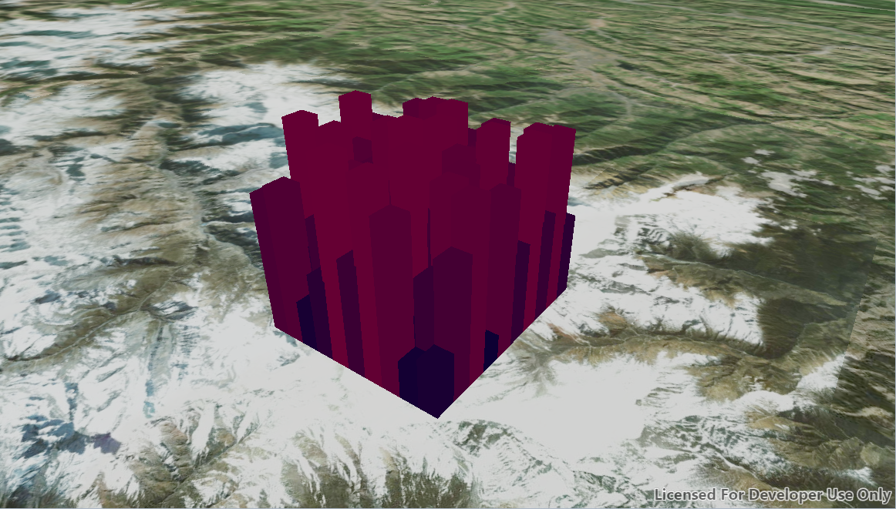

#Extrude Graphics#
Demonstrates how to render graphics extruded in the Z direction.

##How to use the sample##
Zoom and pan the scene to find the extruded graphics. Note how they are extruded to the level set in their height 
property.

##How it works##
To extrude graphics according to a property:

1. Create a `GraphicsOverlay` and `SimpleRenderer`.
2. Get the renderer's `SceneProperties` using `renderer.getSceneProperties()`.
3. Set the extrusion mode for the renderer with `props.setExtrusionMode(ExtrusionMode.BASE_HEIGHT)`.
4. Specify the attribute name of the graphic that the extrusion mode will use: `props.setExtrusionExpression("height")`.
5. Set the renderer on the graphics overlay using `graphicsOverlay.setRenderer(renderer)`.
6. Create graphics with the attribute set: `graphic.getAttributes().put("height", z)`.

##Features##
- ArcGISScene
- Graphic
- GraphicsOverlay
- Renderer
- Renderer.SceneProperties