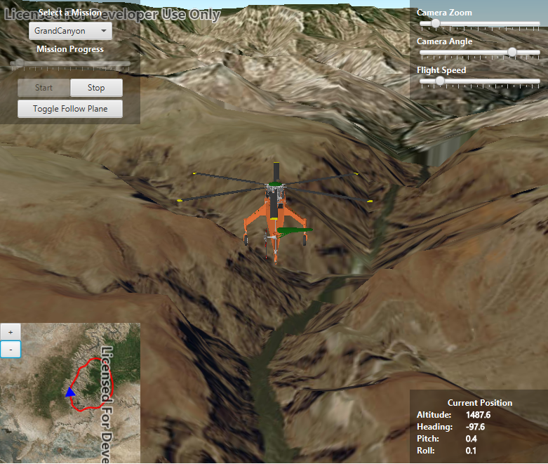

#Mission Replay#
Demonstrates how to animate a `Graphic` that uses a `ModelSceneSymbol`. 

##How to use the sample##
Animation Controls (Top Left Corner):
  - Select a mission -- selects a location with a route for plane to fly
  - Mission progress -- shows how far along the route the plane is
  - Start and Stop -- controls animation of plane
  - Toggle -- keeps camera attach to plane or in a fixed location
  
Camera Controls (Top Right Corner):
  - Camare zoom -- distance between camera and plane
  - Camera angle -- viewing angle between camera and plane
  - Flight speed -- controls speed of animation
  
2D Map Controls (Bottom Left Corner):
  - Plus and Minus -- controls distance of 2D view from ground level

##How it works##
To animate a graphic by updating it's `Point` and `Symbol`'s heading, pitch, and roll:

1. Create a `GraphicsOverlay` and attach it to the `SceneView`.
2. Create a `ModelSceneSymbol` with `AnchorPosition.CENTER`.
3. Create a `Graphic(geometry, symbol)`.
  - set geometry to a `Point` where graphic will be located in view
  - set symbol to the one we made above
4. Add Attributes to graphic.
  - Get attributes from graphic, `Graphic.getAttributes()`.
  - Add heading, pitch, and roll attribute, `planeAttributes.put("HEADING", settings.get(HEADING))`;
5. Create a `SimpleRenderer` to access and set it's expression properties.
  - access properties with `Renderer.getSceneProperties()`
  - set heading, pitch, and roll expressions, `renderProperties.setHeadingExpression("HEADING");`.
6. Add graphic to the graphicsoverlay.
7. Set renderer to graphics overlay, `GraphicsOverlay.setRenderer()`
7. Update graphic's location with `plane3DGraphic.setGeometry(routePoints.get(nextPoint))`.
8. Update symbol's heading, pitch, and roll, `planeAttributes.replace("HEADING", settings.get(HEADING))`.

##Features##
- ArcGISMap
- ArcGISScene
- Camera
- Graphic
- GraphicsOverlay
- LayerSceneProperties.SurfacePlacement
- MapView
- ModelSceneSymbol
- Point
- Polyline
- Renderer
- Renderer.SceneProperties
- SceneView
- Viewpoint
