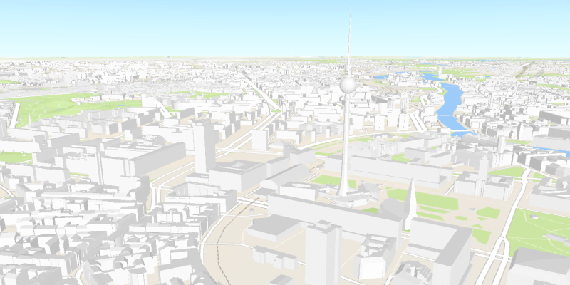

<h1>Open Scene (Portal Item)</h1>

Display a web scene.

Just like Web Maps are the ArcGIS format for maps, Web Scenes are the ArcGIS format for scenes. These scenes can 
be stored in ArcGIS Online or Portal.

<h2>How it works</h2>

To open a web scene:

<ol>
<li>Create a <code>PortalItem</code> with an item ID pointing to a web scene.</li>
<li>Create an <code>ArcGISScene</code> passing in the portal item.</li>
</ol>

<h2>Relevant API</h2>

<ul>
<li>ArcGISScene</li>
<li>Portal</li>
<li>PortalItem</li>
</ul>
