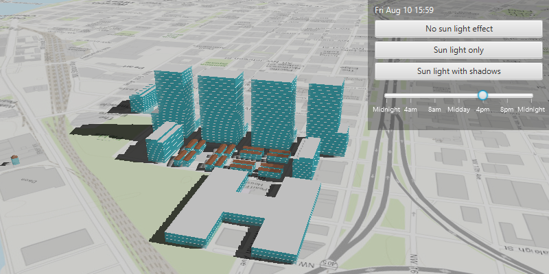

# Realistic lighting and shadows

Show realistic lighting and shadows for the time of day.

## Use case

You can use realistic lighting to evaluate the shadow impact of buildings and utility infrastructure on the surrounding community. This could be useful for civil engineers and urban planners, or for events management assessing the impact of building shadows during an outdoor event.

## How to use the sample

Select one of the three available lighting options to display that lighting effect. Adjust the slider to show the lighting effect for a particular time of day. The 3D buildings will display shadows when "Sun light with shadows" is selected. 

## How it works

1. Create an `ArcGISScene` and display it in a `SceneView`.
2. Create a `Calendar` to define the time of day.
3. Set the sun time to that calendar with `sceneView.setSunTime(calendar)`.
4. Set the `LightingMode` of the scene view to `NO_LIGHT`, `LIGHT`, or `LIGHT_AND_SHADOWS` with `sceneView.setSunLighting(LightingMode)`.

## Relevant API

* ArcGISScene
* LightingMode
* SceneView.setSunLighting
* SceneView.setSunTime

## Tags

3D, lighting, realism, realistic, rendering, shadows, sun, time