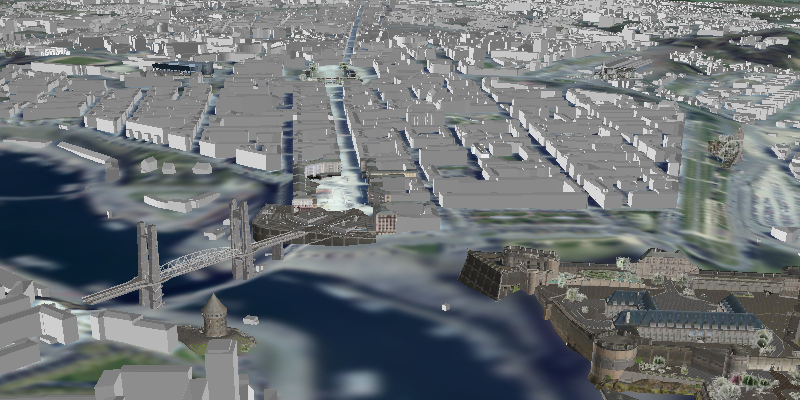

#Scene Layer Sample
Demonstrates how to add a scene layer to a scene.

##How it works
To add an `ArcGISSceneLayer` to a scene:  

1. Create an `ArcGISScene` and set its `Basemap` with `ArcGISScene.setBasemap()`.
2. Create a `SceneView` and set the scene to the view, `SceneView.setScene(scene)`.
3. Create an `ArcGISSceneLayer`:  `sceneLayer = new ArcGISSceneLayer(SCENE_LAYER_SERVICE_URL)`.
4. Add the scene layer to the scene: `Scene.getOperationalLayers().add(sceneLayer)`.

##Tags
- 3D
- ArcGISScene
- ArcGISSceneLayer
- ArcGISTiledElevationSource
- Camera
- SceneView
- Surface
