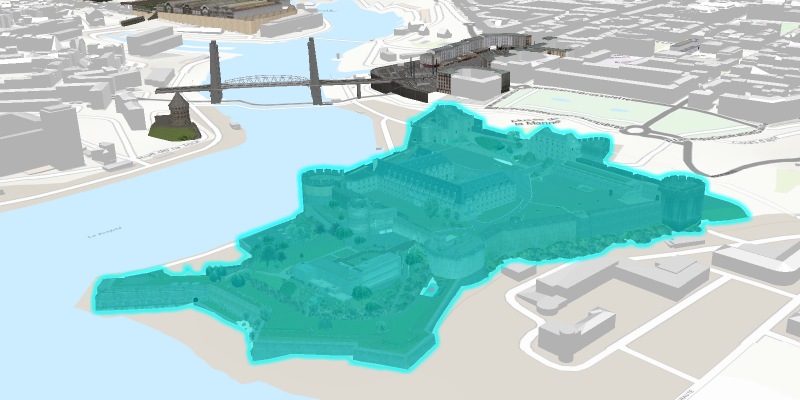

# Scene layer selection

Identify features in a scene to select.

## Use case

You can select features to visually distinguish them with a selection color or highlighting. This can be useful to demonstrate the physical extent or associated attributes of a feature, or to initiate another action such as centering that feature in the scene view.

## How to use the sample

Click a building in the scene layer to select it. Deselect buildings by clicking away from the buildings.

## How it works

1. Create an `ArcGISSceneLayer` passing in the URL to a scene layer service.
2. Use `sceneView.setOnMouseClicked` to get the screen click location `Point2D`.
3. Call `sceneView.identifyLayersAsync(sceneLayer, point2D, tolerance, false, 1)` to identify features in the scene.
4. From the resulting `IdentifyLayerResult`, get the list of identified `GeoElement`s with `result.getElements()`.
5. Get the first element in the list, checking that it is a feature, and call `sceneLayer.selectFeature(feature)` to select it.

## About the data

The scene shows a [buildings layer in Brest, France](https://tiles.arcgis.com/tiles/P3ePLMYs2RVChkJx/arcgis/rest/services/Buildings_Brest/SceneServer/layers/0) hosted on ArcGIS Online.

## Relevant API

* ArcGISSceneLayer
* Scene
* SceneView

## Tags

3D, Berlin, buildings, identify, model, query, search, select
