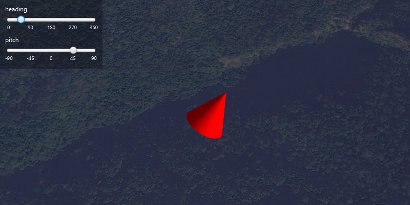

#Scene Properties Expressions#
Demonstrates how to update the orientation of a graphic using scene property rotation expressions.

##How to use the sample##
Move the heading and pitch sliders to change the cone's orientation.

##How it works##
To update a graphic's orientation using expressions:
1. Create a new `GraphicsOverlay`.
2. Create a `SimpleRenderer` and set expressions on its scene properties: `renderer.getSceneProperties()
.setHeadingExpression("HEADING")`. Then set the renderer to the graphics overlay with `graphicsOverlay.setRenderer
(renderer)`.
3. Create a `Graphic` and add it to the graphics overlay.
4. To update the graphic's rotation, use `graphic.getAttributes.put("HEADING", heading)` where the attribute key is 
the expression and the value is the rotation angle.

##Features##
- ArcGISScene
- Graphic
- GraphicsOverlay
- Renderer
- Renderer.SceneProperties
- SceneView
- Viewpoint