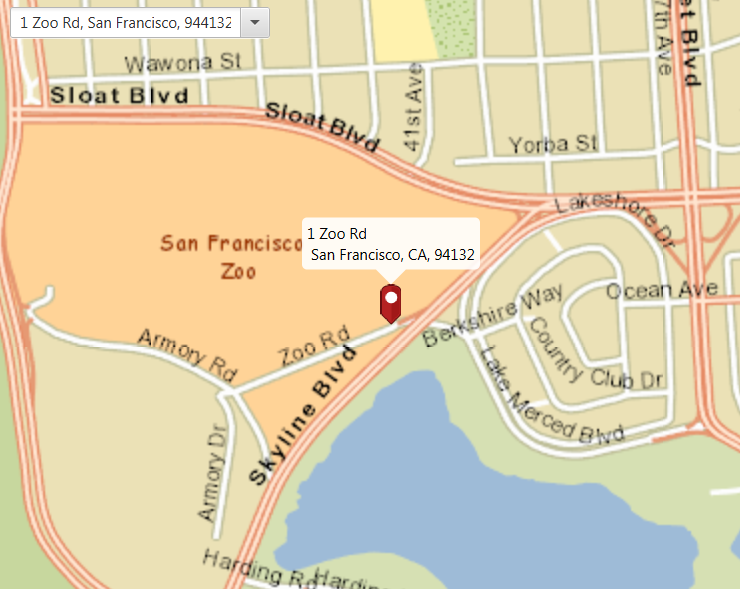

#Find Address#
This sample demonstrates how to perform geocoding and reverse geocoding with offline data.

##How to use the sample##
For simplicity, the sample comes loaded with a set of address. You can select on any address to perform geocoding and show the location. To perform reverse geocoding in real-time, use click on any location on the `ArcGISMap` to provide its address.

##How it works##
 To perform reverse geocoding with offline resources:

- Create the `ArcGISMap`'s basemap, in this case we used an offline `TileCache`. 
- Add the map to the view via `MapView` via `MapView#setMap()`. 
- Create a `LocatorTask` using a URI to the offline locator file and define the `ReverseGeocodeParameters`/`GeocodeParameters` for the LocatorTask.
- To geocode an address, set the `GeocodeParameters` and use the `LocatorTask#geocodeAsync(geocodeParameters)` method.
- To reverse geocode a location, get the `Point` location on the MapView and use the `LocatorTask#reverseGeocodeAsync(Point)` method.
- Show the retrieved results by creating a `PictureMarkerSymbol` with attributes from the result and adding the symbol to a `GraphicsOverlay`.

##Features##
- ArcGISMap
- MapView
- GraphicsOverlay
- ArcGISTiledLayer
- GeocodeParameters
- ReverseGeocodeParameters
- LocatorTask 
- GeocodeResult
