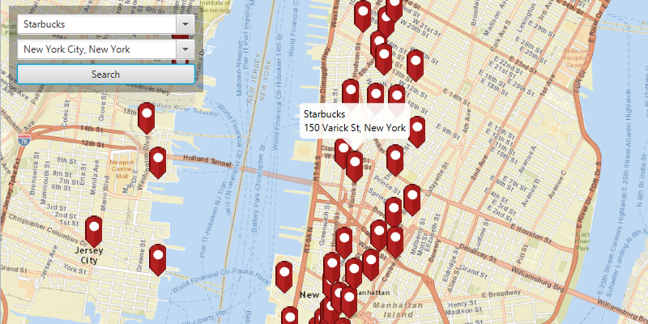

#Find Place#
Demonstrates how find places of interest (POIs) by geocoding near a location or within an specific area.

##How to use the sample##
Choose from the dropdown or input your own place and location to search near. Click the search button to find matching places. A redo search button will appear if you pan the map after a search.

##How it works##
 To find locations matching a query and a search area:

1. Create an `ArcGISMap`'s with `Basemap`.
  - basemap is created using a `TileCache` to represent an offline resource. 
2. Add the map to the `MapView`, `MapView.setMap()`. 
3. Create a `LocatorTask` using a URL and set the `GeocodeParameters`.
4. To reverse geocode near a location, pass the location's position into `GeocodeParameters.setSearchArea(Geometry)` to set the search area.
5. Limit results to the view's visible area using the `MapView.getVisibleArea()` method.
6. Show the matching retrieved results from the `LocatorTask.geocodeAsync(String, GeocodeParameters)` via `PictureMarkerSymbol`s with a `Graphic` in a `GraphicsOverlay`.

##Tags
- ArcGISMap
- GeocodeParameters
- GeocodeResult
- Graphic
- GraphicsOverlay
- LocatorTask 
- MapView
- PictureMarkerSymbol
- ReverseGeocodeParameters
- TileCache
