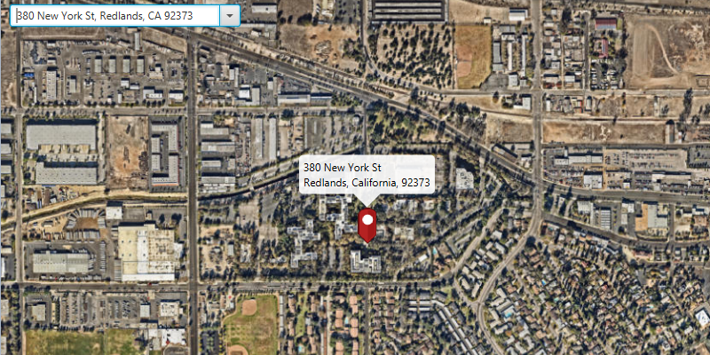

#Geocode Online#
Demonstrates how to geocode an address query and display its location on the ArcGISMap.

##How to use the sample##
For simplicity, the sample comes loaded with a set of addresses. You can select an address to perform online geocoding and show the matching results on the ArcGISMap. 

##How it works##
To get a geocode from a query and display its location on the `ArcGISMap`:

1. Create the ArcGIS map's with `Basemap`.
  - basemap is created using a `TileCache` to represent an offline resource 
2. Create a `LocatorTask` using a URL.
3. Set the `GeocodeParameters` for the locator task and specify the geocodes' attributes.
4. Get the matching results from the `GeocodeResult` using `LocatorTask.geocodeAsync(query, geocodeParameters)`.
5. Lastly, to show the results using a `PictureMarkerSymbol` with attributes and add the symbol to a `Graphic` in the  `GraphicsOverlay`.

##Features
- ArcGISMap
- GeocodeParameters
- GeocodeResult
- GraphicsOverlay
- LocatorTask
- MapView
- ReverseGeocodeParameters
- TileCache
