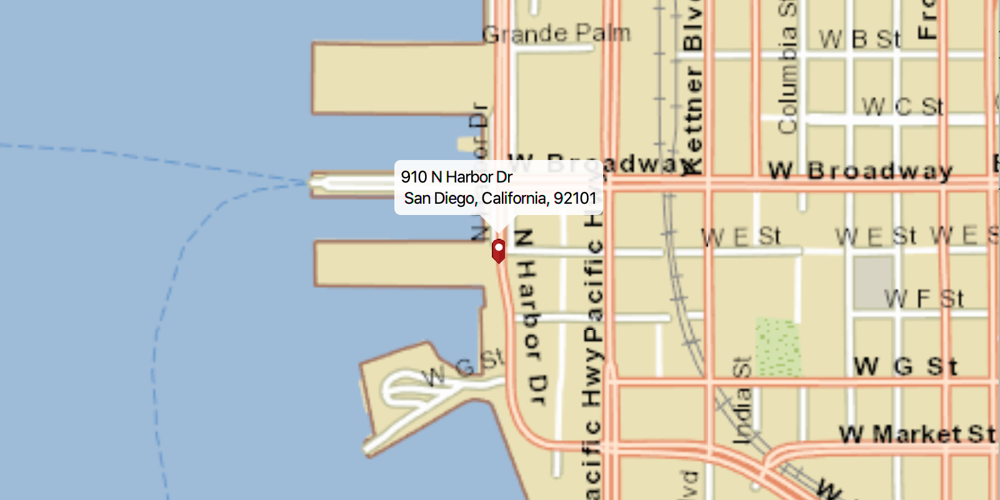

# Offline Geocode

Geocode with offline data.

## How to use the sample

For simplicity, the sample comes loaded with a set of addresses. You can select any address to perform geocoding 
and show it's location on map. You can select the pin and move the mouse to perform reverse geocoding in real-time.
.

## How it works

To perform geocoding with offline resources:

  1. Create an `ArcGISMap`'s using a `Basemap` and add it to the map view.
  * basemap is created using a `TileCache`, which represent our offline resource
  2. Create a `LocatorTask` using a URI to the offline locator file and define the `ReverseGeocodeParameters`/`GeocodeParameters` for  the LocatorTask.
  3. To geocode an address, set the geocode parameters and use `LocatorTask.geocodeAsync(query, geocodeParameters)`.
  4. To reverse geocode a location, get the `Point` location on the map view and use `LocatorTask
  .reverseGeocodeAsync(point, reverseGeocodeParameters)`.
  5. Show the retrieved results by creating a `PictureMarkerSymbol` with attributes from the result and add that symbol to a `Graphic`  in the `GraphicsOverlay`.

## Relevant API

  * ArcGISMap
  * ArcGISTiledLayer
  * Callout
  * MapView
  * LocatorTask
  * GeocodeParameters
  * GeocodeResult
  * Graphic
  * GraphicsOverlay
  * Point
  * PictureMarkerSymbol
  * ReverseGeocodeParameters
  * TileCache

