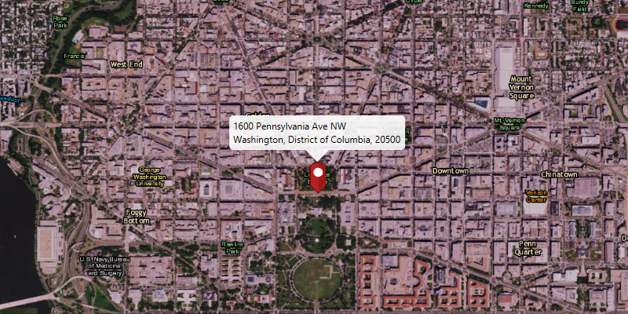

#Reverse Geocode Online#
Demonstrates how to reverse geocode a location and find its nearest address.

##How to use the sample##
You can click on the ArcGISMap to perform online reverse geocoding and show the matching results in the ArcGISMap. 

##How it works##
To perform online reverse geocode:

1. Create the `ArcGISMap`'s with `Basemap`.
  - basemap is created using a `TileCache` to represent an offline resource 
2. Create a `LocatorTask` using a URL.
3. Set the `GeocodeParameters` for the LocatorTask and specify the geocodes' attributes.
4. Get the matching results from the `GeocodeResult` using `LocatorTask.reverseGeocodeAsync()`.
5. Lastly, to show the results using a `PictureMarkerSymbol` with attributes and add the symbol to a `Graphic` in the `GraphicsOverlay`.

##Features##
- ArcGISMap
- GeocodeParameters
- GraphicsOverlay
- LocatorTask
- MapView
- PictureMarkerSymbol
- ReverseGeocodeParameters 
- TileCache
