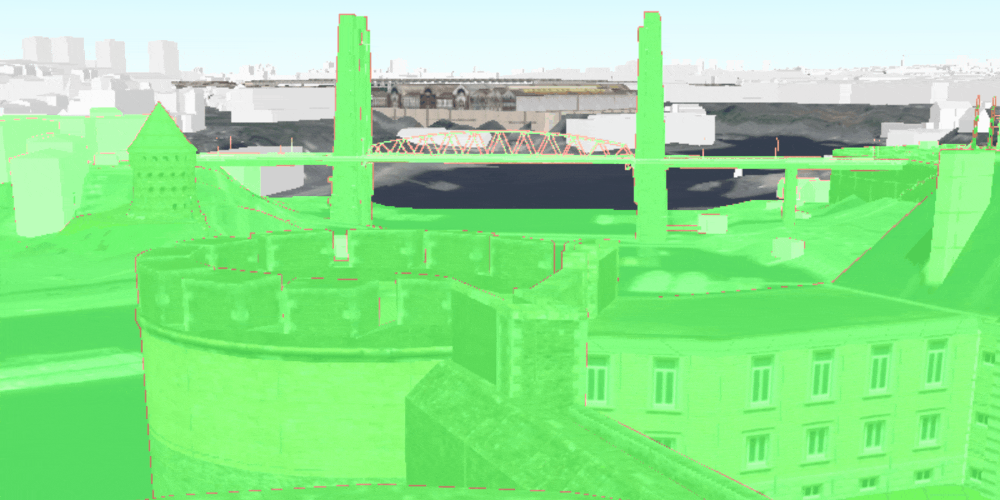

<h1>Viewshed Camera</h1>

Demonstrates how to create and update a viewshed from a camera.

<h2>How it works</h2>

To create and update a viewshed from a camera:

<ol>
  <li>Get a <code>Camera</code> either by creating it, or by getting the current camera from the scene with 
  <code>sceneView.getCurrentViewpointCamera()</code>.</li>
  <li>Create a <code>LocationViewshed</code> passing in the <code>Camera</code> plus a min/max distance.</li>
  <li>To update the viewshed with a new camera, use <code>viewshed.updateFromCamera(camera)</code></li>
</ol>

<h2>Features</h2>

<ul>
  <li>3D</li>
  <li>AnalysisOverlay</li>
  <li>ArcGISTiledElevationSource</li>
  <li>ArcGISScene</li>
  <li>ArcGISSceneLayer</li>
  <li>Camera</li>
  <li>LocationViewshed</code>
  <li>SceneView</li>
</ul>
