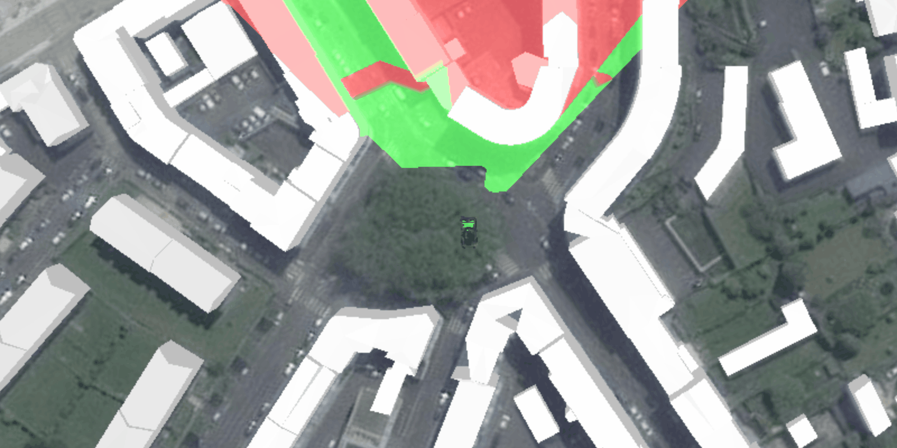

<h1>Viewshed GeoElement</h1>

A viewshed shows the visible and obstructed areas from an observer's vantage point. This sample demonstrates how to attach a viewshed to a moving GeoElement.

<h2>How to use the sample</h2>

Once the scene is done loading, click on a location for the tank to drive to. It will automatically turn and 
drive straight towards the clicked point. The viewshed will automatically move and rotate with the tank.

<h2>How it works</h2>

To attach a viewshed to a <code>GeoElement</code>:

<ol>
  <li>Create a <code>Graphic</code> and add it to a <code>GraphicsOverlay</code>.</li>
  <li>Use a <code>SimpleRenderer</code> in the <code>GraphicsOverlay</code> which has a heading expression set. This 
  way you can relate the viewshed's heading to the <code>GeoElement</code>'s heading.
  <li>Create a <code>GeoElementViewshed</code> with the graphic, heading/pitch offsets, and min/max distance.</li>
  <li>To offset the viewshed's observer location from the center of the graphic, use <code>viewshed.setOffsetX()</code>, etc.</li>
</ol>

<h2>Features</h2>

<ul>
  <li>3D</li>
  <li>AnalysisOverlay</li>
  <li>ArcGISTiledElevationSource</li>
  <li>ArcGISScene</li>
  <li>ArcGISSceneLayer</li>
  <li>GeoElementViewshed</li>
  <li>Graphic</li>
  <li>SceneView</li>
</ul>
