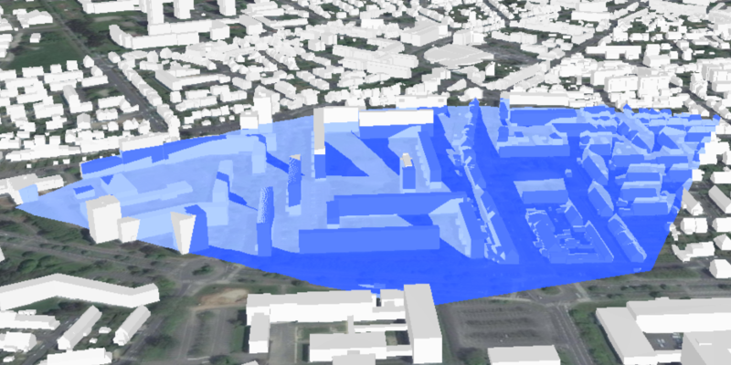

<h1>Viewshed Location</h1>

Demonstrates how to change the properties of a viewshed.

<h2>How to use the sample</h2>

Use the corner UI controls to change the properties of the viewshed and see them updated instantly. To move the 
viewshed, click on the scene and move your mouse. Click again to stop moving the viewshed.

<h2>How it works</h2>

To create a viewshed from a location and directional parameters:

<ol>
  <li>Create a <code>LocationViewshed</code> passing in the observer location, heading, pitch, horizontal/vertical 
  angles, and min/max distances.</li>
  <li>Set the property values directly on the viewshed instance for location, direction, range, and visibility 
  properties. The colors are global, so change them via the static properties on <code>Viewshed</code>.</li>
</ol>

<h2>Features</h2>

<ul>
  <li>3D</li>
  <li>AnalysisOverlay</li>
  <li>ArcGISTiledElevationSource</li>
  <li>ArcGISScene</li>
  <li>ArcGISSceneLayer</li>
  <li>LocationViewshed</code>
  <li>SceneView</li>
</ul>
