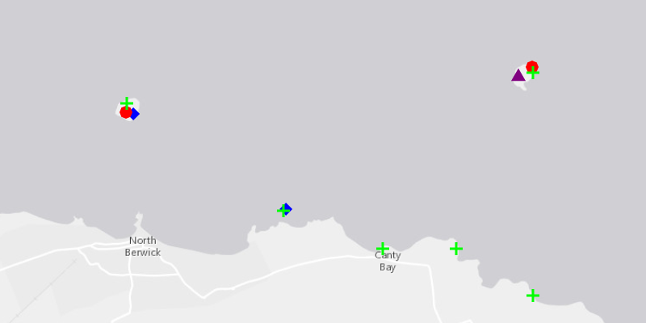

<h1>Add Graphics with Renderer</h1>

Demonstrates how to add graphics to a graphics overlay and display them with a renderer. A renderer allows you to 
change the style of all graphics in an overlay by only changing one copy of the symbol. A renderer will only effect 
graphics that do not specify their own symbol.

<h2>How it works</h2>

To show a <code>Graphic</code> in a <code>GraphicsOverlay</code> using a renderer:

<ol>
  <li>Create a <code>GraphicsOverlay</code> and add it to the <code>MapView</code></li>
  <li>Create a <code>Graphic</code>, specifying only its geometry</li>
  <li>Create a single <code>Symbol</code> such as a <code>SimpleMarkerSymbol</code></li>
  <li>Create a renderer with the symbol such as <code>new SimpleRenderer(symbol)</code></li>
  <li>Set the renderer on the graphics overlay with <code>graphicsOverlay.setRenderer(renderer)</code></li>
</ol>

<h2>Features</h2>

<ul>
  <li>ArcGISMap</li>
  <li>Graphic</li>
  <li>GraphicsOverlay</li>
  <li>MapView</li>
  <li>Point</li>
  <li>SimpleFillSymbol</li>
  <li>SimpleLineSymbol</li>
  <li>SimpleMarkerSymbol</li>
  <li>SimpleRenderer</li>
</ul>
