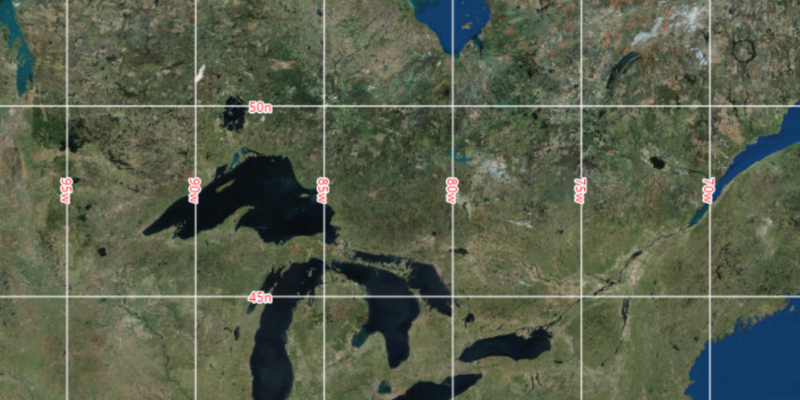

# Display Grid

Display a variety of grids on a map.

## How to use the sample

Select the different grid style options and click “Update” to set the
grid.

## How it works

To show and style a grid:

1.  Create an instance of one of the `Grid` types.
2.  Grid lines and labels can be styled per grid level with
    `grid.setLineSymbol(gridLevel, lineSymbol)` and
    `grid.setTextSymbol(gridLevel, textSymbol)`.
3.  The label position can be set with
    `grid.setLabelPosition(labelPosition)`.
4.  For the `LatitudeLongitudeGrid` type, you can specify a label format
    of `DECIMAL_DEGREES` or `DEGREES_MINUTES_SECONDS`.
5.  To set the grid, use `mapView.setGrid(grid)`.
