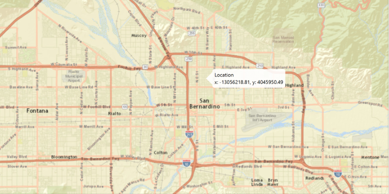

<h1>Show Callout</h1>

Demonstrates how to show coordinates for a clicked location on an ArcGISMap in a Callout.

<h2>How to use the sample</h2>

Click anywhere on the map to show a callout with the clicked location's coordinates.

<h2>How it works</h2>

To show a <code>Callout</code> with the clicked location's coordinates:

<ol>
 <li>Use <code>MapView.setOnMouseClicked()</code> to create a click event handler.</li>
 <li>Create a new Point2D object from the events getX() and getY() coordinates.</li>
 <li>Get the <code>Point</code>s location on the map, <code>MapView.screenToLocation(Point2D)</code>.</li>
 <li>Get the <code>MapView</code>'s callout, <code>MapView.getCallout()</code>.</li>
 <li>Use <code>Callout.setDetail()</code> to display map's point <code>Point.getX()</code> and <code>Point.getY()</code> to screen.</li>
 <li>Show the callout, <code>Callout.showCalloutAt(point)</code>, and dismiss on the next click with <code>Callout.dismiss()</code>.</li>
</ol>

<h2>Features</h2>

<ul>
 <li>ArcGISMap</li>
 <li>Callout</li>
 <li>MapView</li>
 <li>Point</li>
</ul>
