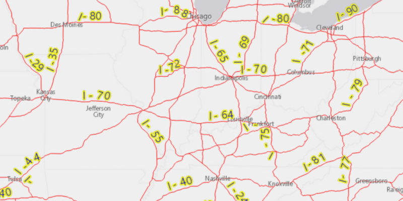

<h1>Show Labels on Layer</h1>

Demonstrates how to show labels on a feature layer.

<h2>How it works</h2>

To show labels on a feature layer:

<ol>
 <li>First, create a <code>FeatureLayer</code> with a <code>ServiceFeatureTable</code> using an online feature 
 service.</li>
 <li>Create a <code>TextSymbol</code> to use for displaying the label text.</li>
 <li>Create a JSON string for the label definition.
    <ul>
        <li> Set the "LabelExpressionInfo.expression" key to express what the text the label should display. You can 
        use fields of the feature by using <code>$feature.field_name</code> in the expression.
        <li>To use the text symbol, set the "symbol" key to the symbol's JSON representation using <code>textSymbol.toJson()</code>.</li>
     </ul>
 </li>
 <li>Create a label definition from the JSON using <code>LabelDefinition.fromJson(json)</code>.</code>
 <li>Add the definition to the feature layer with <code>featureLayer.getLabelDefinitions().add(labelDefinition)
 </code>.</li>
 <li>Lastly, enable labels on the layer using <code>featureLayer.setLabelsEnabled()</code>.</li>
</ol>

<h2>Features</h2>

<ul>
 <li>FeatureLayer</li>
 <li>LabelDefinition</li>
 <li>TextSymbol</li>
</ul>
