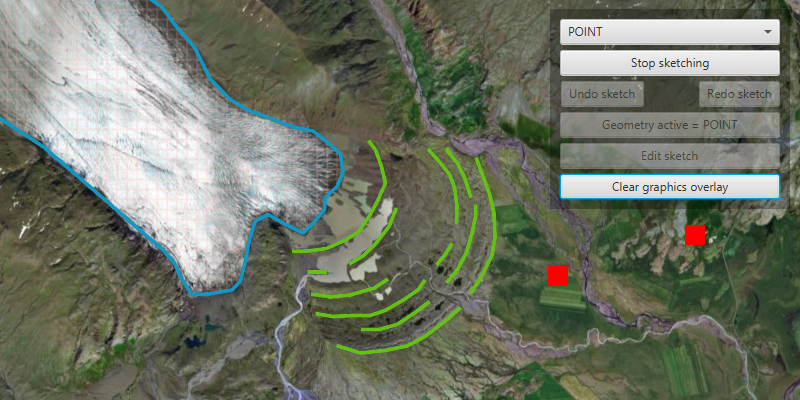

<h1>Sketch on Map</h1>

Use the Sketch Editor to edit, or sketch a new point, line, or polygon geometry on to a map. 

<h2>How to use the sample</h2>

Choose which geometry type to sketch from one of the available buttons. Choose from points, multipoints, polygons, freehand lines and freehand polgons.

Use the control panel to cancel the sketch, undo or redo changes made to the sketch and to save the sketch to the graphics overlay. There is also the option to select a saved graphic and edit its geometry using the Sketch Editor. The graphics overlay can be cleared using the clear all button.

<h2>How it works</h2>

<ol>
<li>Create a <code>SketchEditor</code> and set it to the MapView with <code>mapView.setSketchEditor(sketchEditor)</code>.</li>

<li>Use <code>SketchEditor.start(SketchCreationMode.chooseGeometryType)</code> to start sketching. If editing an existing graphic's geometry, use <code>SketchEditor.start(graphic.getGeometry)</code>.</li>

<li>Check to see if undo and redo are possible during a sketch session using <code>sketchEditor.canUndo()</code> and <code>sketchEditor.canRedo()</code>. If it's possible, use <code>sketchEditor.undo()</code> and <code>sketchEditor.redo()</code>.</li>

<li>Check if sketch is valid using <code>sketchEditor.isSketchValid()</code>, then allow the sketch to be saved to the <code>Graphics Overlay</code>. </li>

<li>Get the geometry of the sketch using <code>sketchEditor.getGeometry()</code>, and create a new <code>Graphic</code> from that geometry. Add the graphic to the <code>Graphics Overlay</code>.</li>

<li>To exit the sketch editor, use <code>sketchEditor.stop()</code>.</li>

</ol>

<h2>Relevant API</h2>

<ul>

<li>Geometry</li>
<li>Graphic</li>
<li>GraphicsOverlay</li>
<li>MapView</li>
<li>SketchCreationMode</li>
<li>SketchEditor</li>

</ul>

<h2>Tags</h2>

draw, edit, Geometry, Graphic, GraphicsOverlay, SketchCreationMode, SketchEditor

