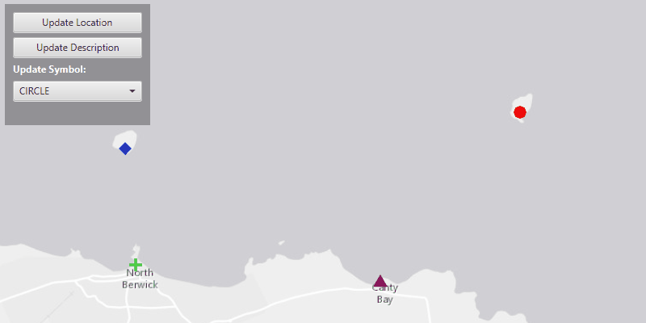

<h1>Update Graphics</h1>

Demonstrates how to identify a Graphic and change it's symbol, attributes, and geometry. Geometry explains the  graphic's location on a map, a symbol controls how a graphic will be displayed to a map, and the attributes help store information about the graphic in a key value pair.

<h2>How to use the sample</h2>

Update Graphic's Location:
  - click on a graphic, then click the update location button
  - now click a new location on the map to move graphic

Update Graphic's Description:
  - click on a graphic, then click the update description button
  - enter a new description and click ok

Update Graphic's Symbol:
  - click on a graphic, then choose a symbol from the update symbol drop down box

<h2>How it works</h2>

How to change a <code>Graphic</code>'s symbol, attributes, and geometry:

<ol>
  <li>Create a <code>GraphicsOverlay</code> and attach it to the <code>MapView</code>.</li>
  <li>Create graphics using a <code>Point</code> and <code>SimpleMarkerSymbol</code>.
    <ul><li>point gives the x,y-coordinate location of where SimpleMarkerSymbol will be located</li></ul></li>
  <li>Add two Attributes to each graphic, <code>Graphic.getAttributes().put()</code>.
    <ul><li>first attribute key NAME and value the name for that graphic</li>
      <li>second attribute key DESCRIPTION and value a description for that graphic</li></ul></li>
  <li>Add graphics to the graphics overlay, <code>GraphicsOverlay.getGraphics().add(graphic)</code>.</li>
  <li>Identify graphic that user has selected using <code>MapView.identifyGraphicsOverlayAsync(GraphicsOverlay,Point2D, tolerance, maximumResults)</code>.
    <ul><li>graphics overlay, the one that was created above</li>
      <li>point2D, from the user mouse click</li>
      <li>tolerance, places buffer around the point2d</li>
      <li>maxiumum result, sets the maximum amount of graphics to return near that point2d</li></ul></li>
  <li>Select graphic that user selected.
    <ul><li>the identify will return a list of graphics</li>
      <li>go through that list and set each graphic's selection to true, <code>Graphic.setSelected()</code></li></ul></li>
  <li>To update graphic's location.
    <ul><li>create a point from the user mouse click, <code>MapView.screenToLocation()</code></li>
      <li>set that point as the selected graphic's new geometry, <code>Graphic.setGeometry()</code></li></ul></li>
  <li>To update graphic's attribute.
    <ul><li>get attrubutes of selected graphic and set DESCRIPTION key, <code>Graphic.getAttributes().put("DESCRIPTION",)</code></li></ul></li>
  <li>To update graphic's symbol.
    <ul><li>get symbol from the drop down box</li>
      <li>assign that symbol to the selected graphic, <code>Graphic.setSymbol()</code></li></ul></li>
</ol>

<h2>Features</h2>

<ul>
  <li>ArcGISMap</li>
  <li>Graphic</li>
  <li>GraphicsOverlay</li>
  <li>MapView</li>
  <li>SimpleMarkerSymbol</li>
</ul>

