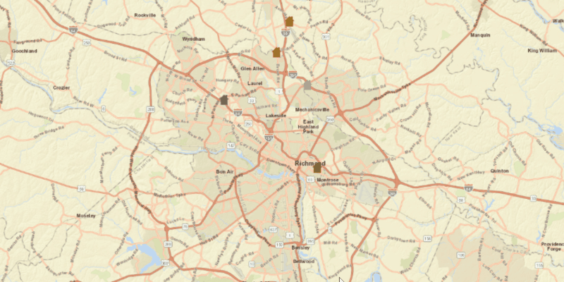

<h1>Add Features</h1>

Demonstrates how to add new Features to a ServiceFeatureTable and apply those Features to it's server. A FeatureLayer created using this SeviceFeatutreTable that is applied to the ArcGISMap will display any new Features automatically.

<h2>How to use the sample</h2>

Click on a location in the MapView to add a Feature at that location.

<h2>How it works</h2>

To add a feature to a <code>ServiceFeatureTable</code> and update it's server with that <code>Feature</code>:

<ol>
<li>Create a service feature table from a URL, <code>new ServiceFeatureTable("URL")</code>.</li>
<li>Create a <code>FeatureLayer</code> from the service feature table, <code>new FeatureLayer(ServiceFeatureTable)</code>.</li>
<li>Create a feature with attributes and a location using service feature table, <code>ServiceFeatureTable.createFeature(attributes, location)</code>.</li>
<li>Apply the addition to the service feature table, <code>ServiceFeatureTable.addFeatureAsync(Feature)</code>.</li>
<li>Update the new feature to the server, <code>ServiceFeatureTable.applyEditsAsync()</code>.</li>
</ol>

<h2>Relevant API</h2>

<ul>
<li>ArcGISMap</li>
<li>Feature</li>
<li>FeatureEditResult</li>
<li>FeatureLayer</li>
<li>MapView</li>
<li>ServiceFeatureTable</li>
</ul>