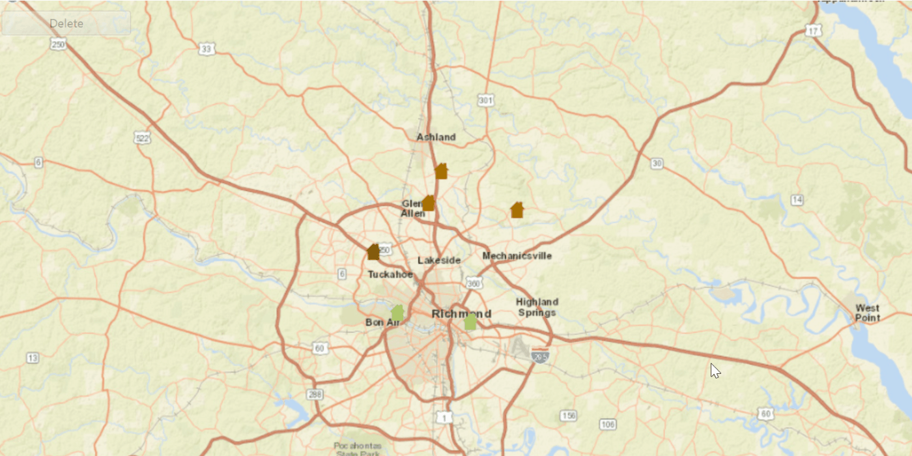

<h1>Delete Features</h1>

Demonstrates how to delete a Feature from a FeatureLayer using a feature service. 

<h2>How to use the sample</h2>

To delete a feature.
  - click on a feature on the Map
  - click on the delete button

<h2>How it works</h2>

To delete a <code>Feature</code> from a <code>ServiceFeatureTable</code>:

<ol>
  <li>Create a service feature table from a URL.</li>
  <li>Create a <code>FeatureLayer</code> from the service feature table.</li>
  <li>Select features from the feature layer via <code>FeatureLayer.selectFeatures()</code>.</li>
  <li>Remove the selected features from the ServiceFeatureTable using <code>ServiceFeatureTable.deleteFeaturesAsync()</code>.</li>
  <li>Update the table on the server using <code>ServiceFeatureTable.applyEditsAsync()</code>.</li>
</ol>

<h2>Features</h2>

<ul>
  <li>ArcGISMap</li>
  <li>Feature</li>
  <li>FeatureLayer</li>
  <li>MapView</li>
  <li>ServiceFeatureTable</li>
</ul>
