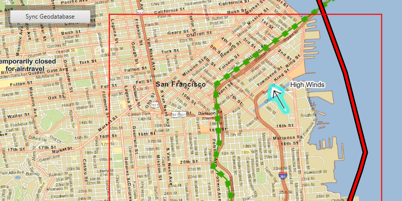

<h1 id="editandsyncfeatures">Edit and sync features</h1>

Synchronize offline edits with a feature service.

<h2 id="howtousethesample">How to use the sample</h2>

<ol>
<li>Pan and zoom into the desired area, making sure the area you want to take offline is within the current extent of the <code>MapView</code>. </li>

<li>Click the Generate Geodatabase button. This will call <code>generateGeodatabase()</code>, which will return a <code>GenerateGeodatabaseJob</code>. </li>

<li>Once the job completes successfully, a <code>GeodatabaseFeatureTable</code> and a <code>FeatureLayer</code> are created from the resulting <code>Geodatabase</code>. The <code>FeatureLayer</code> is then added to the <code>ArcGISMap</code>. </li>

<li>Once the <code>FeatureLayer</code> generated from the local <code>Geodatabase</code> is displayed, a <code>Feature</code> can be selected by clicking on it. The selected <code>Feature</code> can be moved to a new location by clicking anywhere on the map. </li>

<li>Once a successful edit has been made to the <code>FeatureLayer</code>, the Sync Geodatabase button is enabled. This button synchronizes local edits made to the local <code>GeoDatabase</code> with the remote feature service using <code>syncGeodatabase()</code> which generates <code>SyncGeodatbaseParameters</code> and passes them to a <code>SyncGeodatabaseJob</code>.</li>

<li>Once the job successfully completes, the local edits are synchronized with the feature service.</li>
</ol>

<h2 id="howitworks">How it works</h2>

<ol>
<li>Create a <code>GeodatabaseSyncTask</code> from a URL.</li>

<li>Use <code>createDefaultGenerateGeodatabaseParametersAsync(...)</code> to create <code>GenerateGeodatabaseParameters</code> from the <code>GeodatabaseSyncTask</code>, passing in an <code>Envelope</code> argument.</li>

<li>Create a <code>GenerateGeodatabaseJob</code> from the <code>GeodatabaseSyncTask</code> using <code>generateGeodatabaseAsync(...)</code> passing in parameters and a path to the local geodatabase.</li>

<li>Start the <code>GenerateGeodatabaseJob</code> and, on success, load the <code>Geodatabase</code>.</li>

<li>On successful loading, call <code>getGeodatabaseFeatureTables()</code> on the <code>Geodatabase</code> and add it to the <code>ArcGISMap</code>'s operational layers.</li>

<li>To sync changes between the local and web geodatabases:

<ol>
<li>Define <code>SyncGeodatabaseParameters</code> including setting the <code>SyncGeodatabaseParameters.SyncDirection</code>.</li>

<li>Create a <code>SyncGeodatabaseJob</code> from <code>GeodatabaseSyncTask</code> using <code>.syncGeodatabaseAsync(...)</code> passing the <code>SyncGeodatabaseParameters</code> and <code>Geodatabase</code> as arguments.</li>

<li>Start the <code>SyncGeodatabaseJob</code>.</li></ol>
</li>
</ol>

<h2 id="relevantapi">Relevant API</h2>

<ul>
<li>FeatureLayer</li>

<li>FeatureTable</li>

<li>GeodatabaseSyncTask</li>

<li>GenerateGeodatabaseJob</li>

<li>GenerateGeodatabaseParameters</li>

<li>SyncGeodatabaseJob</li>

<li>SyncGeodatabaseParameters</li>

<li>SyncLayerOption</li>
</ul>

<h4 id="tags">Tags</h4>

Edit and Manage Data
