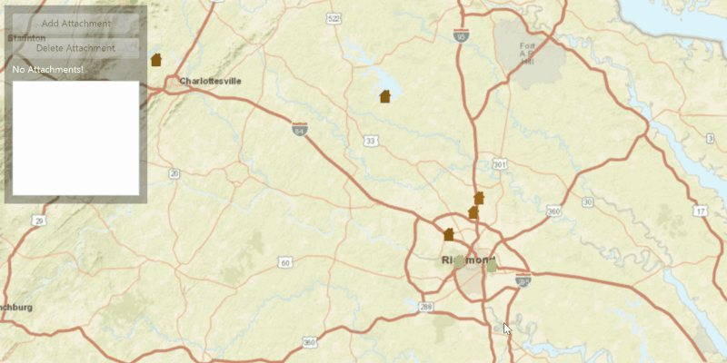

<h1>Edit Feature Attachments</h1>

Demonstrates how you can add, delete, and fetch an attachment from a Feature in a FeatureLayer. 

<h2>How to use the sample</h2>

To add an attachment.
  - click on a feature and then click add attachment button in panel

To delete an attachment.
  - click on a feature, select an attachment from attachment list, and click delete attachment button

<h2>How it works</h2>

To get a <code>Feature</code> from a <code>ServiceFeatureTable</code> and add or delete <code>Attachment</code>:

<ol>
  <li>Create a service feature table from a URL.</li>
  <li>Create a <code>FeatureLayer</code> from the service feature table.</li>
  <li>Select features from the feature layer, <code>FeatureLayer.selectFeatures()</code>.</li>
  <li>To fetch the feature's attachments, cast to an <code>ArcGISFeature</code> and use<code>ArcGISFeature.fetchAttachmentsAsync()</code>.</li>
  <li>To add an attachment to the selected ArcGISFeature, create an attachment and use <code>ArcGISFeature.addAttachmentAsync()</code>.</li>
  <li>To delete an attachment from the selected ArcGISFeature, use the <code>ArcGISFeature.deleteAttachmentAsync()</code>.</li>
  <li>After a change, apply the changes to the server using <code>ServiceFeatureTable.applyEditsAsync()</code>.</li>
</ol>

<h2>Features</h2>

<ul>
  <li>ArcGISFeature</li>
  <li>ArcGISMap</li>
  <li>Attachment</li>
  <li>Feature</li>
  <li>FeatureLayer</li>
  <li>MapView</li>
  <li>ServiceFeatureTable</li>
</ul>

