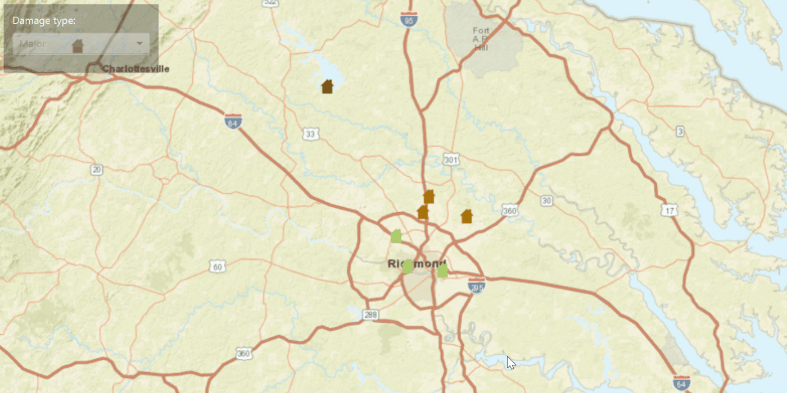

<h1>Update Attributes</h1>

Demonstrates how update the attributes of a Feature from a ServiceFeatureTable.

<h2>How to use the sample</h2>

To change the feature's damage property.
  - select feature from the map
  - from drop down box select a damage type

<h2>How it works</h2>

To get a <code>Feature</code> from a <code>ServiceFeatureTable</code> and update its attributes:

<ol>
  <li>Create a service feature table from a URL.</li>
  <li>Create a <code>FeatureLayer</code> from the service feature table.</li>
  <li>Select features from the feature layer, <code>FeatureLayer.selectFeatures</code>.</li>
  <li>To update the feature's attribute use the <code>ArcGISFeature.getAttributes().put()</code>.</li>
  <li>After a change, apply the changes on the server using <code>ServiceFeatureTable.applyEditsAsync()</code>.</li>
</ol>

<h2>Relevant API</h2>

<ul>
  <li>ArcGISMap</li>
  <li>Feature</li>
  <li>FeatureLayer</li>
  <li>MapView</li>
  <li>ServiceFeatureTable</li>
</ul>
