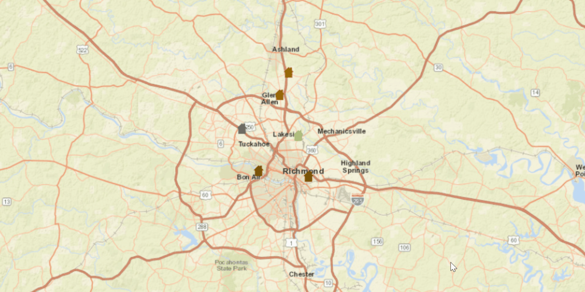

<h1>Update Geometries</h1>

Demonstrates how to update the location of a Feature from a ServiceFeatureTable.

<h2>How to use the sample</h2>

To update a feature's location.
 - click on a feature from the map and then click on another location to move it

<h2>How it works</h2>

To get a <code>Feature</code> from a <code>ServiceFeatureTable</code> and change it's geometry:

<ol>
 <li>Create a service feature table from a URL.</li>
 <li>Create a <code>FeatureLayer</code> from the service feature table.</li>
 <li>Select features from the feature layer, <code>FeatureLayer.selectFeatures</code>.</li>
 <li>Change the selected feature's location using <code>Feature.setGeometry(Geometry)</code>.</li>
 <li>After a change, update the table on the server using <code>ServiceFeatureTable.applyEditsAsync()</code>.</li>
</ol>

<h2>Relevant API</h2>

<ul>
 <li>ArcGISMap</li>
 <li>Feature</li>
 <li>FeatureLayer</li>
 <li>MapView</li>
 <li>ServiceFeatureTable</li>
</ul>
