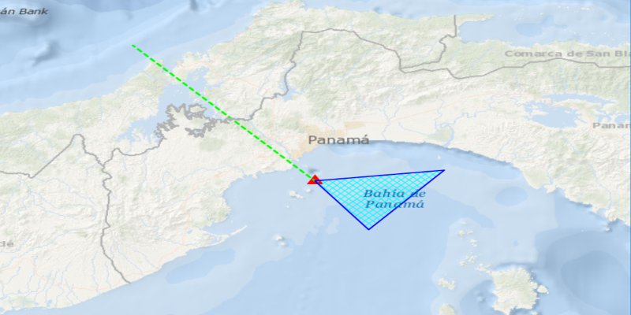

<h1>Feature Collection Layer</h1>

Combine feature tables with different geometries into a single layer.

<h2>How it works</h2>

To display a <code>FeatureCollection</code> as a <code>FeatureCollectionLayer</code> on an <code>ArcGISMap</code> using different <code>FeatureCollectionTable</code>s:

<ol>
    <li>Create a feature collection layer using a new feature collection, <code>new FeatureCollectionLayer(featureCollection)</code></li>
    <li>The layer is then added to the map, <code>ArcGISMap.getOperationalLayers().add(featureCollectionLayer)</code>.</li>
    <li>A feature collection table is then created for the <code>GeometryType</code>s <code>Point</code> <code>Polyline</code> <code>Polygon</code>, <code>new FeatureCollectionTable(fields, geometryType, spatialRefernce)</code>
        <ol>
            <li><code>Field</code>s is a list of the feature's attributes, which this one defines it's name.</li>
        </ol>
    </li>
    <li>A <code>SimpleRenderer</code> is then assigned to each table which will render any <code>Feature</code>s from that table using the <code>Symbol</code> that was set.</li>
    <li>The table is then added to the feature collection, <code>FeatureCollection.getTables().add(featureCollectionTable)</code>.</li>
    <li>To create a feature from the feature collection table use the createFeature method passing an attribute and geometry for that feature, <code>FeatureCollectionTable.createFeature(attributes, geometry)</code>.</li>
    <li>Add new feature to the table, <code>FeatureCollectionTable.addFeatureAsync(feature)</code>.</li>
</ol>

<h2>Relevant API</h2>

<ul>
    <li>FeatureCollection</li>
    <li>FeatureCollectionLayer</li>
    <li>FeatureCollectionTable</li>
    <li>Feature</li>
    <li>Field</li>
    <li>SimpleFillSymbol</li>
    <li>SimpleLineSymbol</li>
    <li>SimpleMarkerSymbol</li>
    <li>SimpleRenderer</li>
</ul>
