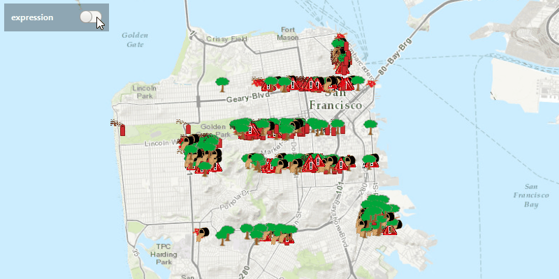

#Feature Layer Definition Expression#
Demonstrates how to set the limit of Features to display on the ArcGISMap.

##How to use the sample##
Use the buttons in the control panel to apply or reset definition expression.

##How it works##
To limit the `Feature`s in your `FeatureLayer`:

1. Create a `ServiceFeatureTable` from a URL.
2. Create a feature layer from the service feature table.
3. Set the limit of the features on your feature layer using `FeatureLayer.setDefinitionExpression(Expression)`.

##Features
- ArcGISMap
- FeatureLayer
- MapView
- ServiceFeatureTable
