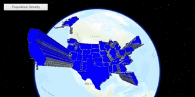

<h1>Feature Layer Extrusion.</h1>

This sample demonstrates how to apply extrusion to a renderer on a feature layer.

<h2>How it works</h2>

To extrude features from a <code>FeatureLayer</code>:

<ol>
  <li>Create a <code>ServiceFeatureTable</code> from an URL.</li>
  <li>Create a feature layer from service feature table.
  <ol>Make sure to set rendering mode to dynamic, <code>statesFeatureLayer.setRenderingMode(RenderingMode.DYNAMIC)</code>.</ol></li>
  <li>Apply a <code>SimpleRenderer</code> to the feature layer.</li>
  <li>Set <code>ExtrusionMode</code> of render, <code>renderer.getSceneProperties().setExtrusionMode(SceneProperties.ExtrusionMode.BASE_HEIGHT)</code>.</li>
  <li>Set extrusion expression of renderer, <code>renderer.getSceneProperties().setExtrusionExpression("[POP2007]/ 10")</code>.</li>
</ol>

<h2>Features</h2>

<ul>
  <li>FeatureLayer</li>
  <li>SceneProperties</li>
  <li>ServiceFeatureTable</li>
  <li>FeatureLayer</li>
</ul>
