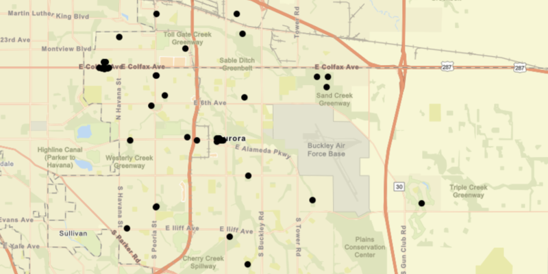

<h1>Feature Layer GeoPackage</h1>

Demonstrates how to create a feature layer from a local GeoPackage (.gpkg file).

<h2>How it works</h2>

To create a <code>FeatureLayer</code> from a local <code>GeoPackage</code>:

<ol>
    <li>Create a <code>GeoPackage</code> passing the URI string into the constructor.</li>
    <li>Load the <code>GeoPackage</code> with <code>GeoPackage.loadAsync</code></li>
    <li>When it's done loading, get the <code>GeoPackageFeatureTable</code>s inside with <code>geoPackage.getGeoPackageFeatureTables()</code></li>
    <li>For each feature table, create a feature layer with <code>FeatureLayer(featureTable)</code>. Add each to 
    the map as an operational layer with <code>map.getOperationalLayers().add(featureLayer)</code></li>
</ol>

<h2>Relevant API</h2>

<ul>
    <li>ArcGISMap</li>
    <li>Basemap</li>
    <li>FeatureLayer</li>
    <li>GeoPackage</li>
    <li>GeoPackageFeatureTable</li>
    <li>MapView</li>
</ul>
