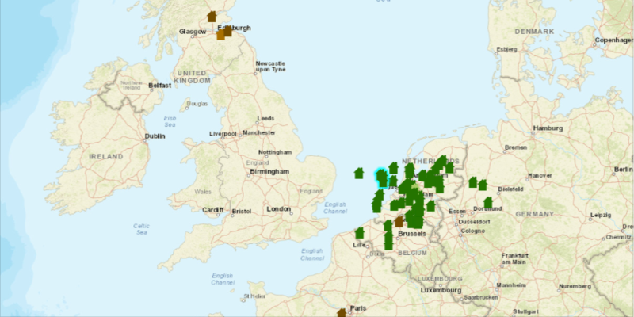

<h1>Feature Layer Selection</h1>

Demonstrates how to select Features from a FeatureLayer.

<h2>How to use the sample</h2>

Click on a feature from the map to select it.

<h2>How it works</h2>

To select <code>Feature</code>s from your <code>FeatureLayer</code>:

<ol>
  <li>Create a <code>ServiceFeatureTable</code> from a URL.</li>
  <li>Create a feature layer from the service feature table.</li>
  <li>Identify <code>MapView</code> on the location the user has clicked <code>MapView.identifyLayerAsync
  (featureLayer, clickLocation, tolerance, returnPopupsOnly, maxResults)
    </code></li>
  <li>Select all features that were identified with <code>FeatureLayer.selectFeatures(features)</code>.</li>
</ol>

<h2>Features</h2>

<ul>
  <li>ArcGISMap</li>
  <li>Feature</li>
  <li>FeatureLayer</li>
  <li>MapView</li>
  <li>ServiceFeatureTable</li>
</ul>
