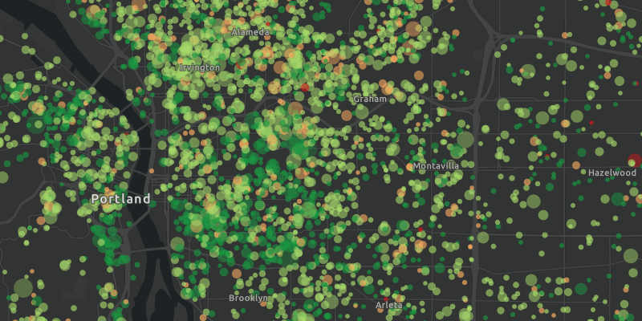

<h1>Feature Request Mode</h1>

Set different feature request modes for a feature table.

Feature tables can be initialized with a feature request mode which controls how frequently features are requested and locally cached in response to panning, zooming, selecting, or querying. The appropriate feature request mode can have implications on performance and should depend on considerations such as how often the data is expected to change or how often changes in the data should be reflected to the user.

<ul>
    <li>ON_INTERACTION_CACHE - fetches features within the current extent when needed (performing a pan or zoom) from the server and caches those features within a table on the client side. Any queries performed on features within that table will be performed locally, otherwise they will be requested from the server. This mode minimizes requests to the server and is useful for large batches of features which will change very infrequently.</li>
    <li>ON_INTERACTION_NO_CACHE - always fetches features from the server and doesn't cache any features on the client side. This mode is useful for features which may undergo heavy editing or whose changes need to always be visible.</li>
    <li>MANUAL_CACHE - only fetches features when explicitly populated from a query. This is useful for features which change minimally or when it is not critical for the user to see the latest changes.</li>
</ul>

<h2>How to use the sample</h2>

Choose a request mode from the combobox. Pan and zoom to see how the features update at different scales. If you choose MANUAL_CACHE, click the "request cache" button to manually get a cache with a subset of features.

Note: The service limits requests to 1000 features.

<h2>How it works</h2>

To specify the feature request mode for a feature table:

<ol>
    <li>Create a <code>ServiceFeatureTable</code> with a feature service URL.</li>
    <li>Set the request mode of the table with <code>serviceFeatureTable.setFeatureRequestMode(featureRequestMode)</code>.
        <ul>
            <li>If using <code>MANUAL_CACHE</code>, populate the features with <code>serviceFeatureTable.populateFromServiceAsync(queryParams, clearCache, outfields)</code>.</li>
        </ul>
    </li>
    <li>Create a <code>FeatureLayer</code> with the feature table and add it to a map's operational layers to display it.</li>
</ol>

<h2>Relevant API</h2>

<ul>
    <li>FeatureLayer</li>
    <li>ServiceFeatureTable</li>
    <li>ServiceFeatureTable.FeatureRequestMode</li>
</ul>

<h2>About the data</h2>

This sample uses a service showcasing over 300,000 street trees in Portland, OR. Each tree point models the health of the tree (green - better, red - worse) as well as the diameter of its trunk.

<h2>Tags</h2>

<ul>
    <li>data, feature</li>
</ul>