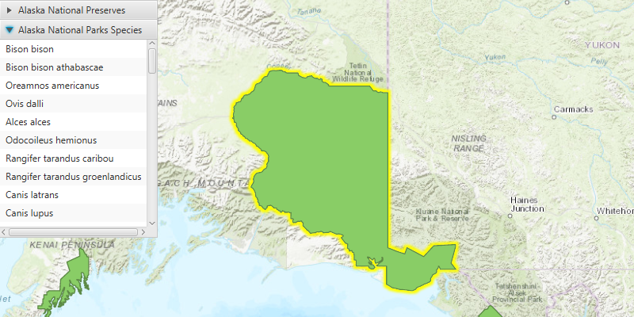

<h1>List Related Features</h1>

Find features related to the selected feature.

<h2>How to use the sample</h2>

After the layer is loaded, click on a feature to select it. An accordion view will display related features 
grouped by feature table.

<h2>How it works</h2>

To query related <code>Feature</code>s:

<ol>
  <li>Get a <code>Feature</code> from a loaded <code>FeatureLayer</code>.</li>
  <li>Get the feature's <code>FeatureTable</code> and call <code>featureTable.queryRelatedFeaturesAsync(feature)</code>.</li>
  <li>You will get a list of <code>RelatedFeatureQueryResult</code>s.
    <ul>
      <li>You can get the name of the table containing the related features with <code>relatedFeatureQueryResult
      .getRelatedTable().getTableName()</code>.</li>
    </ul>
  </li>
  <li>The <code>RelatedFeatureQueryResult</code> implements <code>Iterable&lt;Feature&gt;</code>. You can iterate over 
  the result to get the features:
  <pre><code>for (Feature feature: relatedFeatureQueryResult) {
  //do something with the related feature...
  }</code></pre>
</ol>

<h2>Relevant API</h2>

<ul>
  <li>ArcGISFeature</li>
  <li>ArcGISFeatureTable</li>
  <li>ArcGISMap</li>
  <li>Feature</li>
  <li>FeatureLayer</li>
  <li>FeatureQueryResult</li>
  <li>FeatureTable</li>
  <li>MapView</li>
  <li>RelatedFeatureQueryResult</li>
</ul>
