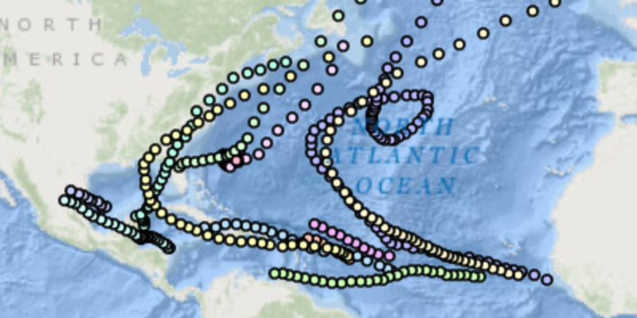

# Time Based Query

Filter features within a time range.

## How it works

To query features by a time extent:

1.  Create a `ServiceFeatureTable` from the URL of a feature service.
2.  Set the feature table’s feature request mode to manual with
    `featureTable.setFeatureRequestMode(MANUAL_CACHE)`.
3.  After loading the service feature table, create `QueryParameters`.
4.  Create two `Calendar` objects with the beginning and ending
    timestamps and create a `TimeExtent` with them.
5.  Set the time extent with `queryParameters.setTimeExtent(timeExtent)`
6.  Populate the table with features in the time extent with
    `featureTable.popuateFromServiceAsync(queryParameters, true,
    outputFields)`.
      - The second argument is whether to clear the cache of features or
        not.
      - The output fields is a list of fields of the features to return.
        Use a list of one string `"*"` to get all of the fields.
7.  Finally, create a feature layer from the feature table with `new
    FeatureLayer(featureTable)`, and add it to the map with
    `map.getOperationalLayers().add(featureLayer)` to see the features
    in the time extent.
