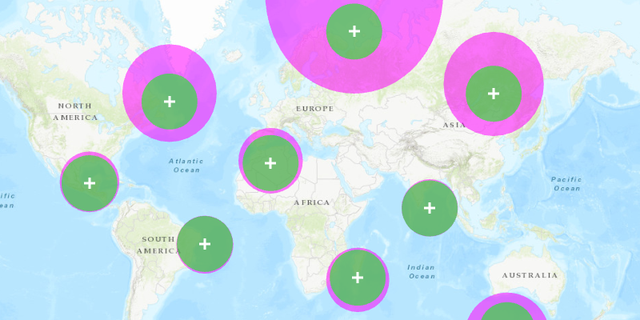

<h1>Buffer</h1>

Shows how to create geodesic and planar buffers around a point.

Buffers can be used to visually show the area within a certain distance of a geometry. For example, the Chernobyl exclusion zone is set up as a buffer around the failed nuclear power plant, indicating where there are unsafe levels of radioactive fallout.

<h2>How to use the sample</h2>

Tap on the map to create planar (green) and geodesic (purple) buffers around the tapped location. Enter a value in the spinner between 500 and 2000 (in miles) to set the 
buffer distance (this range is appropriate to show the difference between geodesic and planar buffers).

<h2>How it works</h2>

To create a buffer around a point:

<ol>
<li>Call <code>GeometryEngine.buffer</code> passing in a <code>Point</code> and a distance
 in meters. This returns a <code>Polygon</code> which can be displayed using a <code>Graphic</code>.</li>
 <li>For the geodesic buffer, call <code>GeometryEngine.bufferGeodetic</code> passing in the point, distance, and <code>GeodeticCurveType.GEODESIC</code>.</li>
</ol>

<h2>Relevant API</h2>
<ul>
<li>GeometryEngine</li>
<li>GraphicsOverlay</li>
<li>Point</li>
<li>Polygon</li>
</ul>

<h2>Additional Information</h2>

It is important to consider the spatial reference of the map you are working with when showing a buffer. A planar buffer with a constant radius is actually closer to an ellipse toward the poles in Web Mercator. In this case, you may want to use a geodesic buffer which takes the Earth's curvature into account.

