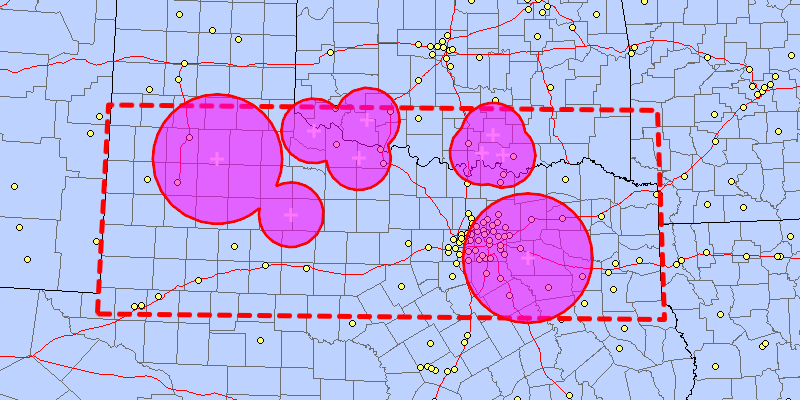

<h1>Buffer list</h1>

Combine buffers from multiple points individual buffer distances.

<h2>How to use the sample</h2>

Tap the map to add points. Each point will use the buffer distance entered when it was created. Check the check box if you want the result to union the buffers. Click the "Create Buffer(s)" button to draw the buffer(s). Click the "Clear" button to start over. The envelope shows the area where you can expect reasonable results for planar buffer operations with the North Central Texas State Plane spatial reference.

<h2>How it works</h2>

To union multiple buffers:

<ol>
    <li>Call <code>GeometryEngine.buffer(points, distances, union)</code> where <code>points</code> are the points to buffer around, <code>distances</code> are the buffer distances for each point (in meters) and <code>union</code> is a boolean for whether the results should be unioned.</li>
    <li>Use the result polygons (if not unioned) or single polygon (if unioned).
</ol>

<h2>Relevant API</h2>

<ul>
<li>GeometryEngine</li>
</ul>

<h2>Additional Information</h2>

The properties of the underlying projection determine the accuracy of buffer polygons in a given area. Planar buffers are generally more accurate if made over small areas in a suitable spatial reference, such as the correct UTM zone or state plane system for the area of interest. Note that inaccurate buffers could still be created by buffering points inside the spatial reference's envelope with distances that move it outside the envelope.

<h2 id="tags">Tags</h2>

Analysis, Buffer, GeometryEngine
