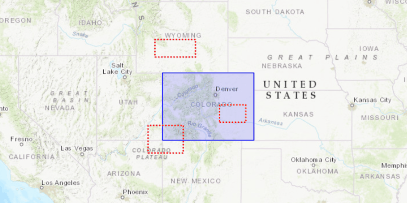

<h1>Clip Geometry</h1>

Demonstrates how to clip a geometry with an envelope using the GeometryEngine.

<h2>How to use the sample</h2>

Click the "Clip" button to clip the blue graphic with the red envelopes.

<h2>How it works</h2>

To clip a <code>Geometry</code> with an <code>Envelope</code>:

<ol>
    <li>Use the static method <code>GeometryEngine.clip(geometry, envelope)</code>.</li>
    <li>Keep in mind that the resulting <code>Geometry</code> may be null if the envelope does not intersect the 
    geometry you are clipping</li>.</code>
</ol>

<h2>Features</h2>

<ul>
    <li>ArcGISMap</li>
    <li>Basemap</li>
    <li>Envelope</li>
    <li>Geometry</li>
    <li>GeometryEngine</li>
    <li>Graphic</li>
    <li>GraphicsOverlay</li>
    <li>MapView</li>
    <li>Point</li>
    <li>PointCollection</li>
    <li>Polygon</li>
    <li>Polyline</li>
    <li>SimpleFillSymbol</li>
    <li>SimpleLineSymbol</li>
    <li>SpatialReferences</li>
</ul>
