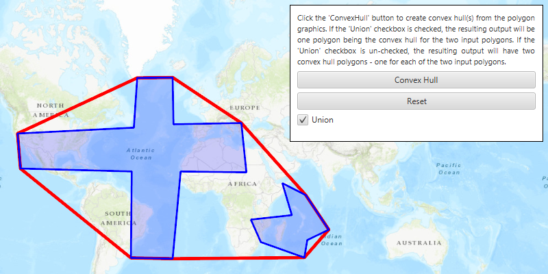

<h1>Convex Hull List</h1>

Generate convex hull polygon(s) from multiple input geometries. As a visual analogy, consider a set of points as nails in a board. The convex hull of the points would be like a rubber band stretched around the outermost nails.

<h2>How to use the sample</h2>

Click the 'Convex Hull' button to create convex hull(s) from the polygon graphics. If the 'Union' checkbox is checked, the resulting output will be one polygon being the convex hull for the two input polygons. If the 'Union' checkbox is un-checked, the resulting output will have two convex hull polygons - one for each of the two input polygons. Click the 'Reset' button to start over.

<h2>How it works</h2>

The static method, <code>GeometryEngine.ConvexHull</code>, is called by passing in a list of polygon geometries and a boolean to union the result if desired. The two input polygons geometries are hard-coded as part of the sample initialization. 

<ol>
<li>Create an <code>ArcGISMap</code> and display it in a <code>MapView</code>.</li>

<li> Create two input polygon graphics and add them to a <code>GraphicsOverlay</code>.</li>

<li>Call <code>GeometryEngine.convexHull(inputGeometries, boolean)</code>, loop through the returned geometry (or geometries) and add them to a new <code>GraphicsOverlay</code>, set above the one containing the two input polygons.</li>
</ol>

<h2>Relevant API</h2>

<ul>
<li><code>GeometryEngine.ConvexHull</li>

<li><code>GraphicsOverlay</code></li>

<li><code>PointCollection</code></li>

</ul>

<h2>Tags</h2>

Analysis, ConvexHull, GeometryEngine 

