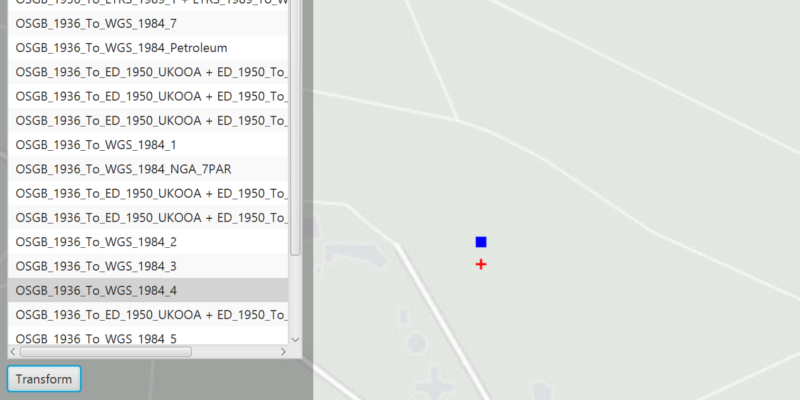

<h1>List Transformations By Suitability</h1>

This sample demonstrates how to use the TransformationCatalog to get a list of available DatumTransformations that
 can be used to project a Geometry between two different SpatialReferences.

Transformations (sometimes known as datum or geographic transformations) are used when projecting data from one 
spatial reference to another, when there is a difference in the underlying datum of the spatial references. 
Transformations can be mathematically defined by specific equations (equation-based transformations), or may rely on 
external supporting files (grid-based transformations). Choosing the most appropriate transformation for a situation 
can ensure the best possible accuracy for this operation. Some users familiar with transformations may wish to 
control which transformation is used in an operation.

<h2>How to use the sample</h2>

<h2>How it works</h2>

To get suitable transformations from one spatial reference to another:

<ol>
    <li>Use <code>TransformationCatalog.getTransformationsBySuitability(inputSR, outputSR)</code> for transformations 
    based on the map's spatial reference OR <code>TransformationCatalog.getTransformationsBySuitability(inputSR, 
    outputSR, mapView.getCurrentVisibileArea().getExtent())</code> for transformations suitable to the current extent
    .</li>
    <li>Pick one of the <code>DatumTransformation</code>s returned. Use <code>GeometryEngine.project(inputGeometry, 
    outputSR, datumTransformation)</code> to get the transformed geometry.</li>
</ol>

<h2>Features</h2>
<ul>
    <li>ArcGISMap</li>
    <li>Basemap</li>
    <li>DatumTransformation</li>
    <li>GeometryEngine</li>
    <li>Graphic</li>
    <li>GraphicsOverlay</li>
    <li>Point</li>
    <li>SimpleMarkerSymbol</li>
    <li>SpatialReference
    <li>TransformationCatalog</li>
</ul>
