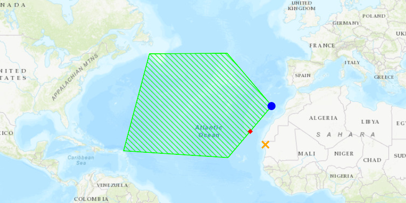

<h1>Nearest Vertex</h1>

Gets the vertex of a geometry closest to a point.

<h2>How to use the sample</h2>

Tap anywhere on the map. An orange marker will show at that tapped location. A blue marker will show the polygon's nearest vertex to the tapped location. A red marker will show the nearest coordinate within the polygon geometry.

<h2>How it works</h2>

<ol>
<li>Get a <code>Point</code> to check the nearest vertex against.</li>
<li>Call <code>GeometryEngine.nearestVertex(inputGeometry, point)</code>. The returned <code>ProximityResult</code> can be used to get the <code>coordinate</code> and distance between the vertex and point.</li>
<li>Call <code>GeometryEngine.nearestCoordinate(inputGeometry, point)</code>. The returned <code>ProximityResult</code> can be used to get the <code>coordinate</code> and distance between the coordinate and point.</li>
</ol>

<h2>Relevant API</h2>

<ul>
<li>GeometryEngine</li>
<li>ProximityResult</li>
</ul>
