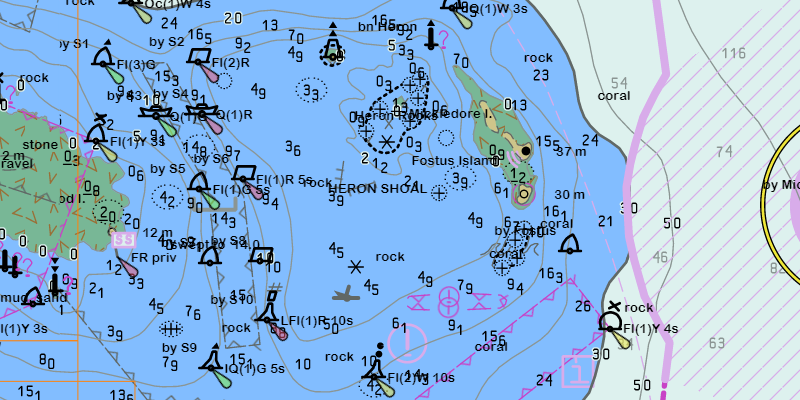

<h1>Add ENC exchange set</h1>

Display nautical charts conforming to the ENC specification.

<h2>Use case</h2>

Maritime applications require conformity to strict specifications over how hydrographic data is displayed digitally to ensure the safety of traveling vessels.

S-57 is the IHO (International Hydrographic Organization) Transfer Standard for digital hydrographic data. The symbology standard for this is called S-52. There are different product specifications for this standard. ENC (Electronic Navigational Charts) is one such specification developed by IHO.

An ENC exchange set is a catalog of data files which can be loaded as cells. The cells contain information on how symbols should be displayed in relation to one another, so as to represent information such as depth and obstacles accurately.

<h2>How it works</h2>

<ol>
<li>Specify the path to a local CATALOG.031 file to create an <code>EncExchangeSet</code>.</li>

<li>After loading the exchange set, loop through the <code>EncDataset</code> objects in <code>encExchangeSet.getDatasets()</code>.</li>

<li>Create an <code>EncCell</code> for each dataset. Then create an <code>EncLayer</code> for each cell.</li>

<li>Add the ENC layer to a map's operational layers collection to display it.</li>
</ol>

<h2>Relevant API</h2>

<ul>
<li>EncCell</li>

<li>EncDataset</li>

<li>EncExchangeSet</li>

<li>EncLayer</li>
</ul>

<h2>Tags</h2>

Data, ENC, maritime, nautical chart, layers, hydrographic
