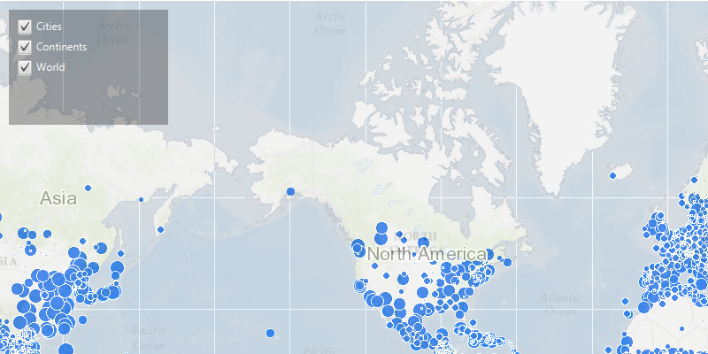

<h1>Map Image Layer Sublayer Visibility</h1>

Demonstrates how to add multiple layers to your ArcGISMap using a BasemapType and an ArcGISMapImageLayer which has multiple sub-layers.

<h2>How to use the sample</h2>

A list of ArcGISSubLayers is display in a drop down box in the top right. Each sublayer in the list has a check-box, which can be used to toggle the visibility of that particular sublayer.

<h2>How it works</h2>

To change visibility of a <code>ArcGISSubLayer</code> from your <code>ArcGISMap</code>:

<ol>
    <li>Create an <code>ArcGISMapImageLayer</code> from its URL.</li>
    <li>Add it to <code>ArcGISMap.getOperationalLayers().add()</code>.</li>
    <li>Display the ArcGISMap by adding it to the <code>MapView</code>.</li>
    <li>Gain access to the sub-layers from the <code>ArcGISMapImageLayer.getSubLayers()</code> method which returns a <code>SubLayerList</code>. The sub layer list is a modifiable list of ArcGISSubLayers. </li>
    <li>Determine if the layer is visible or not by turning on / off the ArcGIS sub layers visibility in the sub layer list.</li>
</ol>

<h2>Features</h2>

<ul>
    <li>ArcGISMap</li>
    <li>ArcGISMapImageLayer</li>
    <li>Basemap</li>
    <li>MapView</li>
    <li>SubLayerList</li>
</ul>
