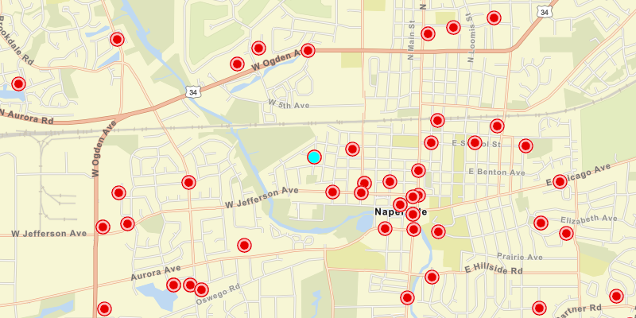

<h1>Map Image Layer Tables</h1>

This sample demonstrates how to get a non-spatial table from an ArcGIS map image layer. It shows how to query such a table, as well as how to find related features in another table.

The non-spatial tables contained by a map service may contain additional information about sublayer features. Such information can be accessed by traversing table relationships defined in the service.

</a>

<h2>How to use the sample</h2>

Once the map image layer loads, a list view will be populated with comment data from non-spatial features. Click on 
one of the comments to query related spatial features and display the first result on the map.

<h2>How it works</h2>

To query a map image layer's tables and find related features:

<ol>
    <li>Create an <code>ArcGISMapImageLayer</code> with the URL of a map image service.</li>
    <li>Load the layer and get one of it's tables with <code>imageLayer.getTables().get(index)</code>.</li>
    <li>To query the table, create <code>QueryParameters</code>. You can use <code>queryParameters.setWhereClause
    (sqlQuery)</code> to filter the features returned. Use <code>table.queryFeaturesAsync(parameters)</code> to get a
     <code>FeatureQueryResult</code>.</li>
     <li>The <code>FeatureQueryResult</code> is an iterable, so simply loop through it to get each result 
     <code>Feature</code>.</li>
     <li>To query for related features, get the table's relationship info with <code>table.getLayerInfo()
     .getRelationshipInfos()</code>. This returns a list of <code>RelationshipInfo</code>s. Choose which one to 
     base your query on.</li>
     <li>Now create <code>RelatedQueryParameters</code> passing in the <code>RelationshipInfo</code>. To query 
     related features use <code>table.queryRelatedFeaturesAsync(feature, relatedQueryParameters)</code>.</li>
     <li>This returns a list of <code>RelatedFeatureQueryResult</code>s, each containing a set of related 
     features</code>.</li>
</ol>

<h2>Features</h2>

<ul>
<li>ArcGISFeature</li>
<li>ArcGISMapImageLayer</li>
<li>Feature</li>
<li>FeatureQueryResult</li>
<li>QueryParameters</li>
<li>RelatedFeatureQueryResult</li>
<li>RelatedQueryParameters</li>
<li>RelationshipInfo</li>
<li>ServiceFeatureTable</li>
</ul>

<h2>Additional information</h2>

You can use <code>ArcGISMapImageLayer.LoadTablesAndLayersAsync()</code> to recursively load all sublayers and tables 
associated with a map image layer.
