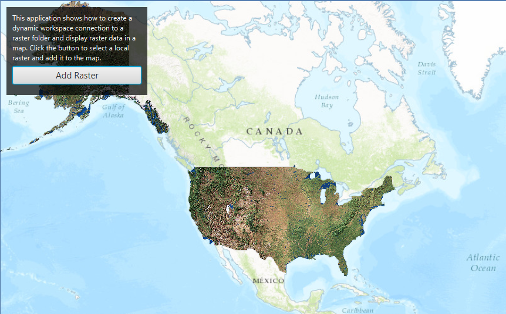

<h1>Local Server Dynamic Workspace Raster</h1>

Demonstrates how to dynamically add a local raster file to map using the Local Server. 

<b>Note:</b> Local Server is not supported on MacOS

<h2>How to use the sample</h2>

A Local Server and Local Feature Service will automatically be started and once running a Feature Layer will be created and added to the map. 

<h2>How it works</h2>

To create a <code>RasterWorkspace</code> and add it to a <code>LocalMapService</code>:

<ol>
<li>Create and run a local server.
<ul><li><code>LocalServer.INSTANCE</code> creates a local server</li></ul>
<li><code>Server.startAsync()</code> starts the server asynchronously</li></ul>
<li>Create a LocalMapService instance using an empty .MPK file (the sample uses one that is created for you). Don't start it yet.</li>
<li>Create the RasterWorkspace and <code>RasterSublayerSource</code> instances.</li>
<li>Add the RasterWorkspace the list of dynamic workspaces of the LocalMapService.</li>
<li>Start the LocalMapService
<ul><li><code>localMapService.startAsync()</code></li></ul>
<ul><li>Wait for server to be in the  <code>LocalServerStatus.STARTED</code> state.</li></ul>
<ul><li><code>localMapService.addStatusChangedListener()</code> fires whenever the status of the local server has changed.</li></ul></li>
<li>Create a <code>ArcGISMapImageLayer</code> using the url from the LocalMapService</li>
<li>Add the <code>ArcGISMapImageSublayer</code> to it's list of sublayers. The ArcGISMapImageSublayer points to the raster file on disk.
<li>Finally, add the ArcGISMapImageLayer to map's list of operational layers. The raster layer appears in the map.</li>
</ol>

<h2>Features</h2>
<ul>
<li>ArcGISMapImageLayer</li>
<li>ArcGISMapImageSublayer</li>
<li>DynamicWorkspace</li>
<li>LocalServer</li>
<li>RasterWorkspace</li>
<li>RasterSublayerSource</li>
<li>StatusChangedEvent</li>
</ul>
