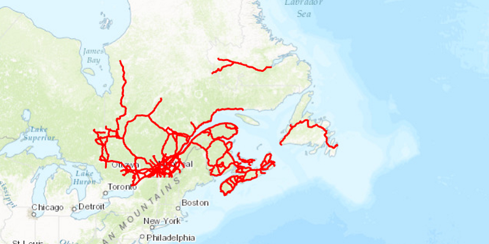

<h1>Local Server Dynamic Workspace Shapefile</h1>

Demonstrates how to dynamically add a local shapefile to a map using the Local Server. 

<b>Note:</b> Local Server is not supported on MacOS

<h2>How to use the sample</h2>

A Local Server will automatically start once application is running. Select a shapefile using the <code>Choose Shapefile</code> button which will automatically start a Local Map Service where a Dynamic Shapefile Workspace will be set and displayed to the Map View.

<h2>How it works</h2>

To create a <code>ShapefileWorkspace</code> and add it to a <code>LocalMapService</code>:

<ol>
<li>Create and run a local server.
<ul><li><code>LocalServer.INSTANCE</code> creates a local server</li></ul>
<ul><li><code>Server.startAsync()</code> starts the server asynchronously</li></ul>
<li>Create a <code>LocalMapService</code> instance using an empty .MPK file (the sample uses one that is created for you). Don't start it yet.</li>
<li>Create a <code>ShapefileWorkspace</code>  with id 'shp_wkspc' and absolute path to location of were shapefile is being stored.</li>
<li>Create a <code>TableSublayerSource</code>  using  <code>shapefileWorkspace.getId()</code> and name of  shapefile with extension, example `mjrroads.shp`.</li>
<li>Add <code>ShapefileWorkspace</code> to <code>LocalMapService.setDynamicWorkspaces()</code>.</li>
<li>Start the <code>LocalMapService</code>
<ul><li><code>localMapService.startAsync()</code></li></ul>
<ul><li><code>localMapService.addStatusChangedListener()</code> fires whenever the status of the local server has changed.</li></ul></li>
<ul><li>Wait for server to be in the  <code>LocalServerStatus.STARTED</code> state.</li></ul>
<li>Create a <code>ArcGISMapImageLayer</code> using <code>localMapService.getUrl()</code></li>
<li>Add the ArcGISMapImageSublayer to it's list of sublayers. The ArcGISMapImageSublayer points to the shapefile file on disk.
<li>Once <code>ArcGISMapImageLayer</code> is done loading,  set <code>ArcGISMapImageSublayer</code> to <code>ArcGISMapImageLayer.getSublayers()</code>. The ArcGISMapImageSublayer points to the shapefile file on disk.</li>
</ol>

<h2>Features</h2>
<ul>
<li>ArcGISMapImageLayer</li>
<li>ArcGISMapImageSublayer</li>
<li>DynamicWorkspace</li>
<li>LocalServer</li>
<li>ShapefileWorkspace</li>
<li>TableSublayerSource</li>
</ul>