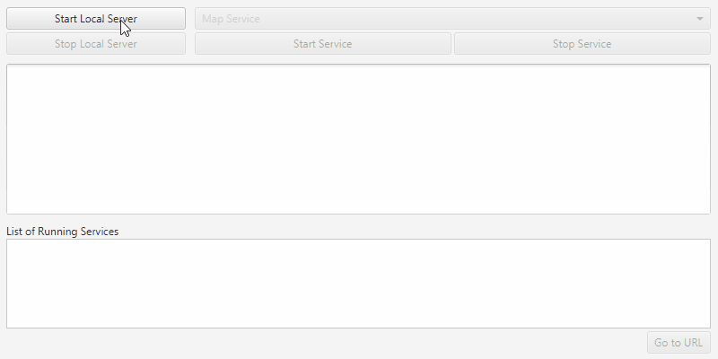

<h1>Local Server Services</h1>

Demonstrates how to start and stop a map, feature, and geoprocessing services on the Local Server.

<b>Note:</b> Local Server is not supported on MacOS

<h2>How to use the sample</h2>

Choose an option from the dropdown control to filter packages by service type. Then click the Open button to 
choose a package. Finally, click the Start button to start the service. The service's status will be displayed in 
the center log.

To stop a service, select it from the Running Services list and click the Stop Service button. To go to the 
service's URL in your default web browser, select it and click the Go to URL button.

<h2>How it works</h2>

To start a <code>LocalService</code>:

<ol>
<li>Start the local server.
<ul><li><code>LocalServer.INSTANCE</code> creates a local server</li>
<li><code>server.startAsync()</code> starts the server asynchronously</li></ul></li>
<li>Wait for server to be in the  <code>LocalServerStatus.STARTED</code> state.
<ul><li><code>Server.addStatusChangedListener()</code> fires whenever the running status of the local server 
changes</li></ul></li>
<li>Create and run a local service.
<ul><li><code>new LocalMapService(Url)</code> creates a local map service with the given url path to mpk file</li>
<li><code>service.startAsync()</code> starts the service asynchronously</li></ul></li>
<li> Stop the service with <code>service.stopAsync().</code></li>
</ol>

<h2>Features</h2>

<ul>
<li>LocalFeatureService</li>
<li>LocalGeoprocessingService</li>
<li>LocalMapService</li>
<li>LocalServer</li>
<li>StatusChangedEvent</li>
<li>LocalServerStatus</li>
<li>LocalService</li>
</ul>
