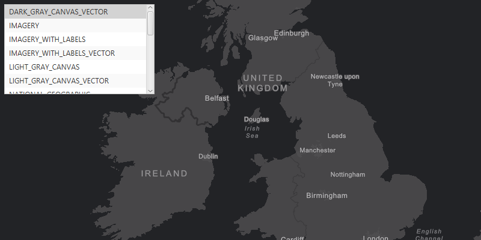

<h1>Change Basemap</h1>

Demonstrates how to change the ArcGISMap's basemap. A basemap is beneath all other layers on an ArcGISMap and is used to provide visual reference to other layers.

<h2>How to use the sample</h2>

Choose any basemap from the list view.

<h2>How it works</h2>

To change the <code>ArcGISMap</code>'s <code>Basemap</code>:

<ol>
  <li>Create an ArcGIS map, <code>ArcGISMap(Basemap, latitude, longitude, scale)</code>.
    <ul><li>Basemap, use basemap type to access a basemap for map, <code>Basemap.Type.NATIONAL_GEOGRAPHIC</code></li>
      <li>latitude and longitude coordinate location</li>
      <li>scale, level of detail displayed on <code>MapView</code></li></ul></li>
  <li>Set the ArcGIS map to the map view.</li>
  <li>Choose a new <code>Basemap.Type</code> and set it to the ArcGIS map to change it. </li>
</ol>

<h2>Features</h2>

<ul>
  <li>ArcGISMap</li>
  <li>Basemap</li>
  <li>Basemap.Type</li>
  <li>MapView</li>
</ul>
