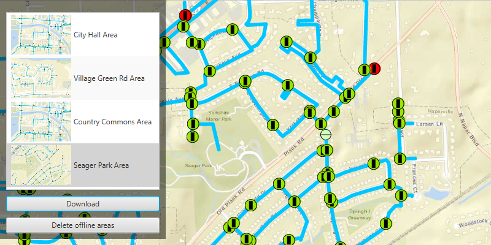

<h1>Download a preplanned map area</h1>

Take a map offline using a preplanned map area.

<h2>Use case</h2>

When a map is taken offline, a package containing basemap tiles, feature data, and other resources is created. In the preplanned workflow, the author of the web map has set up the offline packages ahead of time, which enables faster, more resource-efficient downloads compared to an on-demand workflow. Because the resources for the area are packaged once and can be downloaded many times by different users, this approach is more scalable for large organizations. To see the difference for yourself, compare this sample to the Generate an offline map sample.

<h2>How to use the sample</h2>

Select a map area to take offline, then use the button to take it offline. Click 'Delete offline areas' to remove any downloaded map areas.

<h2>How it works</h2>

<ol>
  <li>Open the map from a Portal item and display it.</li>
  <li>Create an <code>OfflineMapTask</code> from the Portal item.</li>
  <li>Call <code>offlineMapTask.getPreplannedMapAreasAsync()</code> to find the preplanned areas, then load each one by calling <code>mapArea.loadAsync()</code>.</li>
  <li>Display the areas in the UI.</li>
  <li>When the user selects a map area, start the download.
    <ol>
      <li>Create a <code>DownloadPreplannedOfflineMapParameters</code> using <code>OfflineMapTask.createDefaultDownloadPreplannedOfflineMapParametersAsync</code>.</li>
      <li><b>Note:</b> setting the <code>.updateOption()</code> on the parameters allows fine-tuning the update behaviour of the offline map. In this case, the preplanned area is defined not to apply any future updates, <code>SomeEnum.NOUPDATES</code>.</li>
      <li>Create a <code>DownloadPreplannedOfflineMapJob</code> using <code>OfflineMapTask.downloadPreplannedOfflineMap</code>, passing in the parameters.</li>
      <li>Wait for the job to complete and get the result, <code>DownloadPreplannedOfflineMapJob.getResult()</code>.</li>
      <li>Display any errors to the user.</li>
      <li>Show the offline map in the <code>MapView</code>.</li>
    </ol>
  </li>
</ol>

<h2>Relevant API</h2>

<ul>
  <li>DownloadPreplannedOfflineMapJob</li>
  <li>DownloadPreplannedOfflineMapParameters</li>
  <li>DownloadPreplannedOfflineMapResult</li>
  <li>OfflineMapTask</li>
  <li>PreplannedMapArea</li>
</ul>

<h2>About the data</h2>

The <a href="https://arcgisruntime.maps.arcgis.com/home/item.html?id=acc027394bc84c2fb04d1ed317aac674">Naperville stormwater network map</a> is based on ArcGIS Solutions for Stormwater and provides a realistic depiction of a theoretical stormwater network.

<h2>Additional information</h2>

See <a href="https://developers.arcgis.com/net/latest/wpf/guide/take-map-offline-preplanned.htm">Take a map offline - preplanned</a> to learn about preplanned workflows, including how to define preplanned areas in ArcGIS Online.

<h2>Tags</h2>

map area, offline, preplanned, pre-planned
