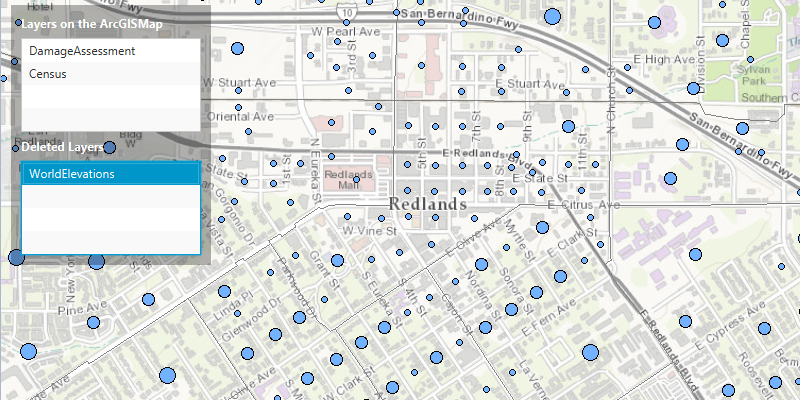

<h1>Manage Operational Layers</h1>

Add, remove and reorder operational layers in a map.

<h2>How to use the sample</h2>

The map in the sample application comes with three ArcGISMapImageLayers already added. In the left control panel are two lists to hold layers. 

First list has the layers that are currently part of the map. Right click on the layer to remove it or left click on the layer to move it to the top.

Second list has layers that have been removed from the first list. Click on layer to add it back to the first list.

<h2>How it works</h2>

To manage the operational layers:

<ol>
<li>Create an <code>ArcGISMap</code>.  </li>
<li>Get the ArcGIS map <code>LayerList</code> using <code>ArcGISMap.getOperationalLayers()</code>.</li>
<li>Add/Remove layers from the ArcGIS map by add/removing them from the layer list.</li>
<li>The last <code>Layer</code> added to the list will be the Layer that is on top.</li>
</ol>

<h2>Relevant API</h2>

<ul>
<li>ArcGISMap</li>
<li>ArcGISMapImageLayer</li>
<li>Basemap</li>
<li>LayerList</li>
<li>MapView</li>
</ul>